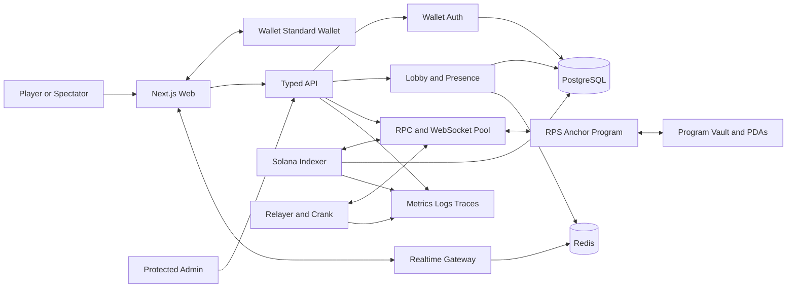
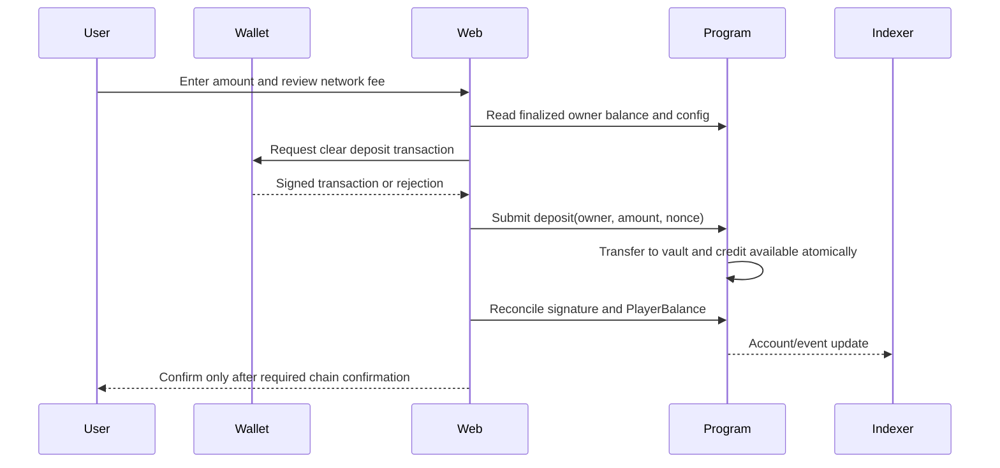

# System Architecture

**Status:** Proposed target; only the non-production web preview exists.  
**Safety posture:** local/devnet first, no real SOL, fail closed for value.

## Principles

1. The Solana program is authoritative for deposited/available/locked balances,
   funded match terms, moves, fallback evidence, outcomes, credits, fees, and
   withdrawals.
2. PostgreSQL, Redis, APIs, indexers, and WebSockets improve experience but
   cannot create financial truth or override chain state.
3. Practice and Play With SOL use visibly separate entry points and mutation
   namespaces. Practice can never reach a financial instruction.
4. Incomplete lobbies are coordination only. Seats and ready checks do not debit
   or reserve balances.
5. Match funding is one all-participant program instruction after explicit,
   match-specific ready consent.
6. Rules and financial terms are immutable per funded match.
7. WebSocket messages are notifications; critical reads reconcile from chain.
8. Plain commit-reveal plus VRF is not sufficient for real-value fairness due to
   selective non-reveal. Mainnet remains blocked pending validated review.
9. No component asks for or stores a seed phrase, wallet private key, or
   unrestricted signing authority.

## Context



## Component responsibilities

### Web application

- Uses the current official Solana React direction and Wallet Standard
  auto-discovery behind a narrow adapter.
- Classifies wallets as tested, detected-not-fully-tested, or unsupported.
- Owns responsive rendering, preferences, selected move/salt generation and
  approved local protection, transaction intent review, and reconciliation UX.
- Independently decodes transaction intent before signature.
- Never treats an API balance, signature string, or optimistic update as proof
  of completion.

### Wallet authentication

Wallet ownership is primary identity. A short-lived, single-use, domain/URI,
wallet, network, purpose, issued-at, and expiry-bound challenge is signed with
`signMessage`. The server verifies exact bytes and consumes the nonce
atomically. The resulting secure, HTTP-only, same-site session authorizes
profile/backend operations only; it is not wager or withdrawal consent.

### Lobby and presence

- Creates public or private waiting lobbies with immutable displayed terms once
  another player occupies a seat.
- Provides expiring seat leases, presence, team selection, ready status, secure
  invite resolution, and rate limiting.
- Public creators cannot reject/kick valid occupied players.
- Private invite codes are high entropy, hash-stored, enumeration-resistant,
  expire with the lobby, and grant no fund control.
- There is no automatic PvP matchmaking, unlisted visibility, or public chat.
- Loss of the service may reopen waiting seats but cannot move funds or alter a
  funded match.

### Typed API

- Serves profiles, usernames, avatars, public lobby cards, private invite
  resolution, indexed history/leaderboards, notifications, status, referrals,
  and protected administration.
- Builds or explains unsigned transactions but cannot sign as a wallet or alter
  owner-bound destinations.
- Returns decimal strings for lamports/counters and an indexed-slot/finality
  watermark for projections.
- Applies schema validation, object authorization, origin/CSRF controls where
  cookies are used, idempotency, and layered rate limits.

### Realtime gateway

- Distributes lobby presence and public on-chain/indexed match updates.
- Match topics expose only phase, commitment/reveal status, timer, public rules,
  score/lives, and post-protocol reveal data.
- Never carries unrevealed moves, salts, session keys, invite secrets, risk
  signals, or backend guesses.
- Clients fetch a snapshot after gaps/reconnects and regularly refresh chain
  state.

### Solana program

Authoritative responsibilities include:

- pooled-vault SOL custody and per-owner `PlayerBalance` accounting;
- deposits, available and locked balances, owner-only withdrawals;
- gameplay-session and ready-consent validation;
- all-or-nothing participant funding;
- immutable rules/fee/timer/team/fallback snapshots;
- commitments, reveals/fallback proof, rounds, scores/lives/elimination;
- winner and fee calculation, one-time settlement, winner balance credits; and
- duplicate/replay/account-substitution prevention.

See [On-Chain Program](04-on-chain-program.md).

### Indexer and reconciler

- Ingests program events/accounts at least once and projects idempotently.
- Maintains observed and finalized watermarks.
- Detects gaps, duplicate/reordered events, owner/schema mismatch, and RPC
  disagreement.
- Periodically scans active/terminal accounts and rebuilds projections.
- Repairs only database views; it never sends discretionary money movement.

### Relayer and crank

- Optionally pays gameplay transaction fees and submits session-signed actions.
- Invokes permissionless deterministic timeout/progression/settlement.
- Cannot widen session scope, change instructions/destinations, choose moves or
  winners, or withdraw.
- Is replaceable; protocol liveness cannot depend on one server key.

### Administration

Protected administration may manage feature flags, status banners, new-game
pauses, future-match fee/wager limits, usernames/avatars, monitoring, failed
settlement review, referrals, and analytics. Program governance uses
multisignature/timelock where appropriate. Administrators cannot choose winners,
alter moves/scores, redirect individual payouts, withdraw player balances,
rewrite completed history, or modify funded-match fees.

## Trust boundaries

| Boundary                         | Untrusted input                                    | Required control                                                                           |
| -------------------------------- | -------------------------------------------------- | ------------------------------------------------------------------------------------------ |
| Browser → API                    | Addresses, names, filters, lobby commands, amounts | Zod/schema validation, auth/object authorization, escaping, rate limits, idempotency       |
| Wallet → browser/program         | Account, capabilities, signatures, rejection       | Exact intent/domain binding; capability detection; no broad implied consent                |
| Browser/session → program        | Session action, match/seat, commitment/reveal      | Program/action allowlist, expiry, nonce, max wager, match scope, signer/PDA checks         |
| API/indexer → browser            | Profiles, projected balances/history, status       | Treat as untrusted display data; direct-chain reconciliation for critical state            |
| RPC/WS → clients/workers         | Account bytes, status, logs, ordering              | Owner/program/genesis validation, multiple providers, finality and reconciliation          |
| Random/reveal provider → program | Request, proof, timing, output                     | Snapshotted provider/program, freshness, replay binding, unbiased derivation, retry policy |
| Admin → controls                 | Flags, fee defaults, pauses, moderation            | MFA, least privilege, approval workflow, audit trail, on-chain caps and prohibitions       |

## Primary flows

### Deposit



### Lobby ready and atomic funding

```mermaid
sequenceDiagram
    participant Players
    participant Lobby
    participant Program
    participant Relayer

    Players->>Lobby: Occupy expiring seats
    Note over Players,Program: No funds are reserved or locked
    Lobby-->>Players: Full roster, exact rules, wager, fee, payout
    Players->>Program: Match-specific ready consent via owner/scoped session
    Relayer->>Program: fund_match(all balances and consents)
    Program->>Program: Validate every player before mutation
    alt every check passes
        Program->>Program: Debit all available and credit all locked atomically
        Program-->>Players: Funded active match
    else any check fails
        Program-->>Players: Transaction fails; every balance unchanged
    end
```

### Match and settlement

Players submit canonical commitments. The approved reveal/fallback protocol
provides on-chain-verifiable moves without backend discretion. The program
resolves each round using the snapshotted game module. At terminal state,
`settle_match` atomically decreases locked liabilities, credits winners'
available balances, accrues the snapshotted fee, and writes a one-time receipt.
“Collect Winnings” is an acknowledgement, not a transaction.

### Withdrawal

The owner selects partial/all available balance, reviews the exact amount and
network fee, and signs `withdraw(owner, amount, nonce)`. The program enforces
owner destination, excludes locked funds, debits/transfers/writes receipt
atomically, and increments nonce. Rejection/failure changes nothing; replayed
nonce cannot pay twice.

## Recovery and degradation

| Failure                        | Required behavior                                                          |
| ------------------------------ | -------------------------------------------------------------------------- |
| Wallet unavailable             | Practice and public watching remain; no false connected state              |
| Lobby service unavailable      | New/seat coordination degrades; no balance effect                          |
| RPC primary unavailable        | Circuit-break to independent fallback; reconcile before retry              |
| WebSocket gap                  | Poll/fetch snapshot; do not apply stale transitions blindly                |
| Indexer delayed                | Label stale projection; direct-chain active match/balance view             |
| Backend restart                | Rebuild from PostgreSQL/outbox and chain; active match continues           |
| Relayer unavailable            | Another crank/user can submit allowed deterministic actions                |
| Random/reveal provider delayed | Apply snapshotted permissionless retry/recovery; never reroll              |
| New games paused               | Existing matches, fallback, settlement, credits, safe withdrawals continue |
| Unknown transaction            | Retain signature/intent and block replacement until reconciled             |

## Repository/service boundaries

- `apps/web`: player/spectator web.
- `apps/admin`: separately protected operations UI.
- `apps/api`: auth, profiles, lobbies, indexed queries, admin policy.
- `apps/indexer`: chain ingestion and reconciliation.
- `apps/crank`: replaceable permissionless progression/relaying.
- `programs/rps`: authoritative Anchor program.
- `packages/protocol` and `packages/game-rules`: canonical codecs and pure
  versioned rule engines shared with tests.
- `packages/solana-client`: wallet/RPC/program adapter.
- `packages/db`, `auth`, `observability`, `ui`, `branding`, and `config`:
  platform modules with no direct RPS rule coupling.

## Acceptance criteria

- Incomplete lobby join/leave/ready tests show no on-chain balance change.
- Atomic funding tests prove one failure leaves all balances unchanged.
- Practice cannot import or call fund/deposit/withdraw transaction builders.
- Direct-chain state overrides stale/duplicate/missing index events.
- Session tests prove no withdrawal/arbitrary transfer/fee/destination access.
- Financial tests prove vault solvency and exact fee-plus-credit conservation.
- Completed matches verify from program ID, match PDA, rules, moves/fallbacks,
  rounds, credits, fee, and settlement transaction.
- Real-SOL flags cannot be enabled from frontend configuration alone, and
  mainnet has no fallback from missing environment configuration.
