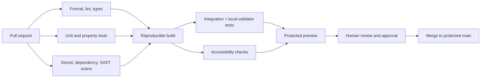

# Repository and Environments

**Status:** Target structure and deployment policy  
**Current repository:** Greenfield; see [Current State](./00-current-state.md)

This document defines the intended monorepo, strict environment isolation, and
safe-deployment process for the architecture in
[System Architecture](./02-system-architecture.md) and requirements in
[Product Requirements](./01-product-requirements.md).

## 1. Known repository and hosting metadata

- GitHub origin: `https://github.com/axelrodx3/RPS`
- Default branch: `main`
- Initial branch state: no commits
- Vercel scope/project: `axes-projects-c08a9d9a/rps`
- Vercel project ID: `prj_FLL0rD159hy1B5f1KLjn5IHENZe0`
- Vercel root directory: `.`
- Vercel Node.js version: `24.x`
- Initial framework preset: `Other`

The local directory is now linked to this existing project and a protected
non-production Next.js preview has been deployed. These facts are not proof of a
safe wagering deployment; environment bindings, domains, and production access
remain future reviewed work.

## 2. Target monorepo

Use pnpm workspaces with Turborepo, strict TypeScript, current stable Next.js
for web applications, Node/TypeScript services, PostgreSQL, Redis where
measured, and an Anchor/Rust program. Runtime dependencies remain subject to the
evaluation gates in the roadmap.

### Recommended technology stack

| Area                 | Recommendation                                                                                  | Reason / constraint                                                        |
| -------------------- | ----------------------------------------------------------------------------------------------- | -------------------------------------------------------------------------- |
| Workspace            | pnpm lockfile and Turborepo                                                                     | Explicit package boundaries, cached validation, one dependency graph       |
| Player/admin web     | Current stable Next.js App Router, React, strict TypeScript                                     | Public rendering, Vercel support, typed server/client boundaries           |
| Solana React         | `@solana/react-hooks` and `@solana/client`/Wallet Standard behind `packages/solana-client`      | Current official direction; auto-discovery; adapter limits ecosystem churn |
| Client data          | TanStack Query for server/indexed queries; direct Solana adapter for canonical reads            | Clear cache, freshness, and reconciliation ownership                       |
| Validation/contracts | Zod schemas with generated OpenAPI                                                              | Shared runtime validation; financial integers remain decimal strings       |
| Accessible UI        | Headless reviewed primitives plus first-party tokenized components                              | Focus/keyboard behavior without coupling branding                          |
| API                  | Node.js/TypeScript with Fastify and generated OpenAPI client                                    | Explicit service surface, schema hooks, predictable operations             |
| Database access      | PostgreSQL 16+ with Kysely or a similarly thin typed SQL layer and reviewed migrations          | Preserve explicit constraints/indexes and avoid hidden financial behavior  |
| Presence/cache       | Redis for expiring presence, rate limits, fan-out, and disposable cache only                    | Never financial authority                                                  |
| Chain services       | Separate TypeScript indexer/reconciler and relayer/crank processes                              | Independent failure domains and no privileged outcome key                  |
| Program              | Rust plus a current tested Anchor/Solana toolchain, exact versions pinned before implementation | Familiar validation/test model; reproducible build and audit required      |
| Tests                | Rust/Anchor local validator, Vitest, component tests, Playwright, property/fuzz/model tests     | Pure rules through browser/mobile recovery and financial invariants        |
| Observability        | OpenTelemetry-compatible logs, metrics, and traces with strict redaction                        | Vendor portability and end-to-end correlation without secret leakage       |

Adoption requires review of maintenance, advisories/audits, license, transitive
and unsafe code, browser bundle impact, runtime compatibility, removal cost, and
failure modes. Popularity alone is not an acceptance criterion.

```text
RPS/
├─ apps/
│  ├─ web/                    # Player, spectator, profile, and balance UI
│  ├─ admin/                  # Separately authorized operator UI
│  ├─ api/                    # HTTP API, auth, policy, public reads
│  ├─ indexer/                # Solana ingestion and reconciliation
│  └─ crank/                  # Replaceable relaying and permissionless progression
├─ packages/
│  ├─ config/                 # Typed, validated runtime configuration
│  ├─ branding/               # Replaceable identity and asset references
│  ├─ protocol/               # API/on-chain codecs and generated clients
│  ├─ game-rules/             # Pure versioned rules and state transitions
│  ├─ auth/                   # Challenge and session primitives
│  ├─ solana-client/          # Wallet/RPC/program adapters and allowlist guards
│  ├─ db/                     # Schema, migrations, repositories
│  ├─ observability/          # Logging, metrics, tracing, redaction
│  ├─ ui/                     # Accessible shared UI components
│  └─ testing/                # Fixtures, local-validator helpers, fakes
├─ programs/
│  └─ rps/                    # Authoritative future Anchor program; not scaffolded
├─ tests/
│  ├─ e2e/
│  ├─ integration/
│  ├─ security/
│  ├─ accessibility/
│  └─ load/
├─ infra/
│  ├─ vercel/
│  ├─ database/
│  ├─ observability/
│  └─ scripts/
├─ docs/
│  ├─ adr/                    # Architecture decision records
│  ├─ runbooks/               # Future incident and operational procedures
│  └─ ...                     # Current baseline documents
├─ .github/
│  └─ workflows/
└─ workspace configuration
```

### Boundary rules

- Apps may consume packages; packages must not import app internals.
- `game-rules` remains deterministic, side-effect-free, and unaware of transport
  or UI.
- Only the on-chain program is authoritative for balance-affecting entries; `db`
  may project them.
- Solana RPC and transaction code lives behind `solana-client` interfaces.
- Browser bundles cannot import server configuration, database, ledger
  internals, signer code, or secrets.
- Admin UI and player UI may share accessible primitives, not authorization
  assumptions.
- API/event contracts are schema-first, versioned, and compatibility-tested.
- Database migrations are forward-safe and reviewed alongside
  rollback/mitigation plans.

## 3. Environment model

Environments are isolated security domains, not labels.

| Environment                 | Purpose                                          | Solana connection                                                   | Assets                                     | Data                              | Access                            |
| --------------------------- | ------------------------------------------------ | ------------------------------------------------------------------- | ------------------------------------------ | --------------------------------- | --------------------------------- |
| Local development           | UI/service iteration                             | Disabled or deterministic mocks                                     | None                                       | Synthetic/local                   | Developer machine                 |
| Local validator             | Program/integration iteration                    | Dedicated local validator and local program ID                      | Test lamports only                         | Disposable fixtures               | Developer machine                 |
| Automated tests             | Deterministic CI validation                      | Ephemeral local validator or mocks                                  | Test lamports only                         | Ephemeral/synthetic               | CI workload identity              |
| Devnet                      | Wallet/provider integration and adversarial beta | Allowlisted devnet RPC/WS and devnet program ID                     | Devnet SOL only                            | Dedicated devnet DB/cache         | Approved testers                  |
| Preview                     | Pull-request review                              | Mock/local equivalent; devnet only by explicit protected exception  | Test only                                  | Isolated preview data             | Protected team access             |
| Staging                     | Production-like validation                       | Separate allowlisted devnet infrastructure/program                  | Devnet SOL only                            | Dedicated synthetic/test accounts | Team and approved testers         |
| Mainnet configuration       | Conditional future audited beta only             | Separate mainnet RPC/WS and program ID; no fallback from other envs | Real SOL only after explicit approval/caps | Separate production DB/cache      | Restricted approved cohort        |
| Production preview/practice | Public practice service initially                | **No Solana settlement enabled**                                    | **No real SOL; wager disabled**            | Dedicated practice data           | Public practice; restricted admin |

Mainnet endpoint, chain identity, or real SOL configuration must be rejected.
“Production” identifies operational isolation and public practice hosting; it
does not mean production wagering is approved.

### Required isolation

Each environment must have separate:

- Database, cache/queues, object storage, encryption context, and backups
- Vercel environment variables and deployment aliases/domains
- RPC credentials and allowlists, where RPC is permitted
- Wallet/session domain and cookie namespace
- Analytics dataset/project and pseudonymization keys
- Feature-flag environment and safe defaults
- Operator roles and audit sink
- Rate limits, alert routes, and incident context
- Settlement/test signer identities, if enabled

No environment may read another environment's database or secrets. Production
data must not be copied to local, preview, CI, or staging. Sanitized synthetic
fixtures are the default.

## 4. Configuration contract

Runtime configuration should be parsed once at process startup through a typed
schema. Missing, malformed, contradictory, or unsafe values stop affected
services before they accept traffic.

Illustrative categories:

```text
APP_ENV
PUBLIC_APP_ORIGIN
DATABASE_URL
CACHE_URL
SESSION_SECRET / encryption-key reference
SOLANA_MODE=disabled|local-validator|devnet
SOLANA_RPC_URL
SOLANA_EXPECTED_GENESIS_HASH
WAGER_MODE=disabled|sandbox
SETTLEMENT_MODE=disabled|observe|submit-test
FEATURE_FLAG_ENVIRONMENT
ANALYTICS_MODE=disabled|consented
OTEL_EXPORTER_...
```

Actual names should be documented in a future configuration reference. Controls
must enforce:

- `SOLANA_MODE` has no `mainnet` option.
- Production defaults to `SOLANA_MODE=disabled`, `WAGER_MODE=disabled`, and
  `SETTLEMENT_MODE=disabled`.
- Non-mainnet mode validates both RPC host allowlist and observed
  cluster/genesis identity.
- Public client variables contain only non-secret presentation configuration.
- Secrets are references managed by hosting/secret infrastructure, never checked
  into source.
- Logging prints safe configuration shape and hashes/identifiers where useful,
  never values of secrets or full RPC credentials.
- Wager activation requires environment capability, a server-side feature flag,
  database/runtime readiness, and operator approval. None can bypass the others.

## 5. Branch, preview, and data policy

- `main` is the protected integration branch and should remain releasable.
- Changes use short-lived branches and reviewed pull requests.
- Required checks include formatting, linting, type checks, unit/integration
  tests, dependency and secret scans, migration validation, accessibility
  checks, and environment policy checks.
- Preview deployments are untrusted review artifacts. They receive no production
  secrets, data, wallet authority, or settlement signer.
- Fork-originated workflows receive no privileged secrets.
- Preview databases, if provisioned, are isolated per preview or use a safe
  shared synthetic environment with tenant enforcement.
- Preview URLs display an unmistakable environment banner.
- Deleting a branch should trigger bounded cleanup of preview resources under an
  audited process.

## 6. CI validation pipeline



Additional policy checks should search compiled and runtime configuration for:

- Mainnet genesis hash, known mainnet RPC endpoints, or unsupported cluster
  values
- Accidentally bundled secrets or server-only modules
- Wager enabled in public production configuration
- Missing migration, contract compatibility, or feature-flag metadata
- Unreviewed lockfile or dependency provenance changes

Tests should include startup attempts with malicious/incorrect RPC redirects and
assert that observed cluster identity wins over URL naming.

## 7. Safe deployment sequence

### Practice deployment

1. Produce an immutable build artifact from a reviewed commit.
2. Verify provenance, dependency/secret scans, tests, and environment-policy
   checks.
3. Apply compatible database migrations using a reviewed, monitored process.
4. Deploy to staging with wager and settlement disabled.
5. Run smoke, accessibility, auth-negative, and observability tests.
6. Promote the same reviewed artifact to production rather than rebuilding.
7. Confirm production starts with Solana settlement and wager disabled.
8. Run public-route, practice-game, health, alert, and rollback smoke tests.
9. Observe defined service-level indicators through a bounded rollout window.

### Non-mainnet wager sandbox

The sandbox belongs in staging or another dedicated restricted environment, not
public production.

1. Confirm release-gate sign-offs from product, engineering, security, privacy,
   accessibility, operations, and legal/compliance owners.
2. Verify isolated test database, queues, flag environment, RPC credentials, and
   test signers.
3. Verify RPC cluster/genesis identity independently.
4. Run ledger invariants, reconciliation, commit-reveal vectors, abuse controls,
   and emergency-stop drills.
5. Enable `observe` dependencies before transaction submission where applicable.
6. Allowlist internal/test accounts and low test limits.
7. Enable flags in dependency order: visibility, lobby browse, reservation,
   gameplay, then test settlement.
8. Monitor invariants and reconciliation continuously; stop on discrepancies.
9. Record activation, owners, approvals, limits, and expiry.

No step in this sequence enables real SOL or mainnet.

## 8. Vercel-specific baseline

Before first deployment to the existing Vercel project:

- Confirm the project still maps to `axes-projects-c08a9d9a/rps` and ID
  `prj_FLL0rD159hy1B5f1KLjn5IHENZe0`.
- Keep root directory `.` only if workspace-aware install/build configuration is
  intentional.
- Replace framework preset `Other` only after choosing the web framework; verify
  automatic detection does not alter expected output.
- Pin the package manager and lockfile. Ensure it supports Node `24.x`, or
  deliberately change the project runtime through review.
- Define exact install, build, output, and ignore commands.
- Separate Development, Preview, and Production variables; do not duplicate
  privileged values into Preview.
- Enable deployment protection for nonpublic previews and admin surfaces.
- Configure custom domains and session cookie domains deliberately.
- Prevent server-only source maps, logs, and environment values from becoming
  public artifacts.
- Ensure API/realtime/worker workloads are hosted on infrastructure suited to
  their connection duration and execution model; do not assume every component
  belongs on Vercel.
- Test regional placement and database latency before setting performance
  expectations.

## 9. Database migrations and compatibility

- Use expand/migrate/contract changes so old and new application versions can
  coexist during rollout.
- Never combine a destructive schema change with code that immediately requires
  it.
- Backfill in bounded, resumable, observable jobs.
- Add constraints only after data validation.
- Review ledger migrations with invariant queries and reconciliation
  before/after.
- Migration identity, checksum, actor, start/end time, and result are audited.
- Rollback usually means application rollback/forward fix plus compensating
  migration; destructive down migrations are not a default strategy.

## 10. Secrets and signing authority

- Store secrets in approved Vercel/environment secret stores or a dedicated
  secrets/KMS system.
- Use workload identities and short-lived credentials where available.
- Keep settlement/test signing authority separate by environment and purpose.
- Prefer constrained program or transaction authority over general-purpose hot
  keys if a future reviewed design allows it.
- Apply rotation, access review, alerting, and emergency revocation.
- Never expose signing authority to preview deployments, browsers, logs, support
  tools, or analytics.
- Never request or store player private keys or seed phrases.
- A compromised test signer must be assumed possible; limits and pause controls
  bound impact.

## 11. Feature flags and emergency controls

Flags complement but cannot replace deployment and configuration isolation.

Minimum server-side controls:

- Global wager visibility
- New wager lobby creation
- Matchmaking/join
- New reservations
- New deposits/withdrawals, if implemented
- Test settlement submission
- Referral attribution/rewards
- Spectator publication
- Per-game-mode and per-stake-tier exposure

Financial flags fail closed and have an owner, rationale, scope, prerequisites,
rollout, audit trail, and expiry/review date. Emergency control access is
restricted and rehearsed.

When pausing:

1. Stop new risk first.
2. Preserve durable in-flight state.
3. Drain, complete, refund, or route each in-flight item to review according to
   its recorded rules.
4. Reconcile before reopening.
5. Communicate user-visible status without promising a completion time not
   supported by evidence.

## 12. Rollback and incident response

A safe rollback plan exists before deployment:

- Define health thresholds and who can initiate rollback.
- Keep the previous compatible artifact available.
- Prefer traffic rollback for stateless regressions.
- Do not roll back past incompatible migrations; use a compatible forward fix.
- Pause new wager actions before touching settlement during a related incident.
- Preserve audit, game, and ledger evidence.
- Rotate exposed credentials and invalidate affected sessions when warranted.
- Reconcile ledger and external test settlement before resuming.
- Publish accurate user status and perform a blameless post-incident review.

Runbooks should cover auth compromise, RPC mismatch/outage, stuck games, ledger
invariant failure, reconciliation discrepancy, queue backlog, signer exposure,
flag-provider outage, database degradation, and admin-account compromise.

## 13. Backup, recovery, and retention

- Encrypt backups and isolate access by environment.
- Define recovery point and recovery time objectives before test-wager access.
- Test restoration into a quarantined environment; a configured backup is not
  evidence of recoverability.
- Validate restored ledger invariants, audit continuity, and outbox/worker
  replay behavior.
- Document retention for auth challenges, sessions, profiles, games, ledger,
  chain observations, audit logs, analytics, reports, and backups.
- User deletion/anonymization must preserve legally or operationally required
  ledger/audit integrity while minimizing linkable profile data.

## 14. Environment and deployment acceptance criteria

- CI and application startup reject all mainnet cluster identities and
  unsupported RPC endpoints.
- Production boots and operates practice with wager and settlement disabled.
- Preview receives no production secret, data, signer, analytics dataset, or
  admin authority.
- Environment cookie, database, cache, flags, analytics, and key namespaces
  cannot collide.
- An artifact promoted to production is traceable to reviewed source and CI
  results.
- Required checks block merge/deployment on secret, dependency, type, test,
  migration, accessibility, or environment-policy failure.
- Staging smoke tests exercise wallet rejection, nonce replay, game reconnect,
  ledger retry, pause, and reconciliation paths.
- Rollback and migration compatibility are demonstrated before broad rollout.
- Backup restore and emergency-pause drills succeed before sandbox activation.
- Vercel project settings are explicitly reviewed after framework selection;
  initial `Other` configuration is not assumed correct.
- Real SOL and mainnet remain unavailable in every environment.

## 15. Change-control rule

Any change that introduces custody, a new asset, a new chain/cluster, mainnet
connectivity, public wager access, settlement authority, or materially different
game economics requires:

1. Updated product, architecture, environment, risk, and operational
   documentation.
2. A reviewed architecture decision.
3. Security and legal/compliance approval.
4. Independent audit appropriate to the change.
5. New acceptance tests and incident runbooks.
6. Explicit organizational authorization.

Neither merging code nor toggling a feature flag constitutes that authorization.
