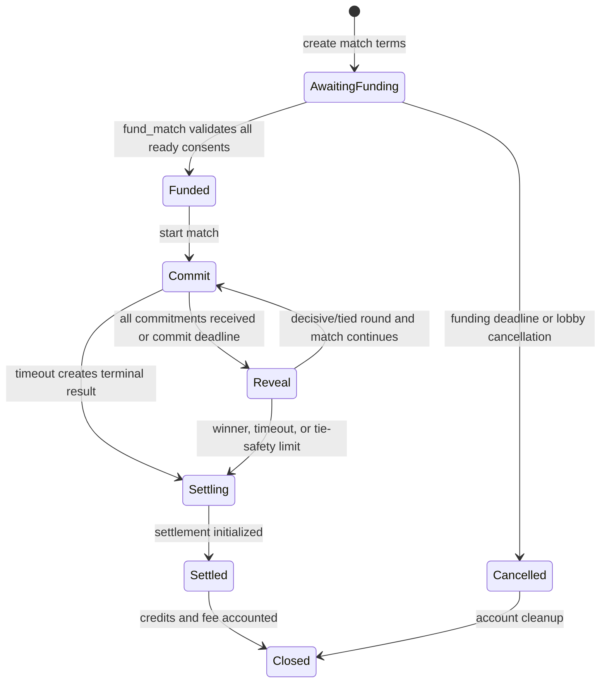

# On-Chain Program Architecture

## Purpose and trust boundary

The Solana program is the sole authority over deposited RPS balances, locked
match funds, match state transitions, fee calculation, balance credits, and
owner withdrawals. SOL is held by a program-controlled pooled vault with
per-wallet and per-match liabilities; it is never represented by an
authoritative database balance. The backend may submit transactions, relay
scoped actions, and index state, but it cannot alter a funded match, choose a
winner, redirect a payout, or withdraw player funds.

The design uses commit–reveal so a player cannot choose a move after seeing an
opponent's move. Team and free-for-all modes use the same phase machine and
immutable, versioned rules snapshots.

## Core invariants

1. Every controlled lamport is attributable to an available player balance,
   locked match liability, pending deterministic credit, or accounted treasury
   fee.
2. `vault_assets >= available_liabilities + locked_liabilities + pending_credits + withdrawable_treasury`.
3. A funded match's participants, stake, rules, fee, timeout policy, tie limit,
   and payout policy never change.
4. No account supplied by a client can replace a payout destination captured
   from the funded player slot.
5. Every settlement and withdrawal path is idempotent.
6. All additions and multiplications use checked integer arithmetic; no floating
   point is used.
7. The protocol fee is snapshotted at funding, defaults to 200 basis points, and
   can never exceed 500 basis points.
8. Administrative pause can prevent new risk but cannot strand already escrowed
   player funds.
9. Program-derived accounts, not a server key, control escrow.

## Program-derived addresses

| Account              | PDA seeds                                 | Created                             | Closed                                        | Purpose                                                                       |
| -------------------- | ----------------------------------------- | ----------------------------------- | --------------------------------------------- | ----------------------------------------------------------------------------- |
| `ProtocolConfig`     | `["config"]`                              | Once at initialization              | Never in normal operation                     | Governance, treasury, current fee/rules policy, pause flags                   |
| `VaultAuthority`     | `["vault"]`                               | Once at initialization              | Never                                         | Program-controlled SOL custody and aggregate liability counters               |
| `PlayerBalance`      | `["balance", owner]`                      | Owner initializes or first deposits | Only at zero with no pending/locked liability | Owner, available/locked amounts, lifetime deposits/withdrawals, nonce/version |
| `GameplaySession`    | `["session", owner, session_key]`         | Owner wallet authorizes             | Owner revokes or safe expiry cleanup          | Allowed actions, expiry, revocation epoch, match scope, wager/action limits   |
| `ReadyConsent`       | `["ready", match, owner]`                 | Owner/scoped session marks ready    | Consumed by funding or expired/revoked        | Match-specific consent binding terms, seat/team, maximum exact wager, expiry  |
| `RulesVersion`       | `["rules", version_u32_le]`               | Governance publishes version        | Never while referenced; preferably never      | Canonical rule template and hash for future matches                           |
| `Match`              | `["match", creator, client_match_id_16]`  | Match creation                      | After terminal state and retention delay      | State machine, immutable snapshot, accounting totals                          |
| `PlayerSlot`         | `["player", match, slot_u8]`              | Invitation/acceptance               | With match                                    | Identity, team/seat, payout address, funding and claim state                  |
| `Round`              | `["round", match, round_u16_le]`          | Round begins                        | With match                                    | Commitments, reveals, result, deadlines                                       |
| `MatchLiability`     | `["liability", match]`                    | Atomic match funding                | After settlement retention                    | Per-seat locked amounts and pot accounting within the pooled vault            |
| `SettlementReceipt`  | `["settlement", match]`                   | Terminal settlement                 | With match after retention                    | Immutable replay guard and payout summary                                     |
| `DepositReceipt`     | `["deposit", owner, deposit_nonce]`       | Deposit                             | After audit retention if safe                 | Deposit replay/indexing identity                                              |
| `WithdrawalReceipt`  | `["withdrawal", owner, withdrawal_nonce]` | Owner withdrawal                    | After audit retention if safe                 | Owner-bound replay guard, exact amount/destination/result                     |
| `TreasuryAccounting` | `["treasury"]`                            | Initialization                      | Never in normal operation                     | Accrued and withdrawn house fees, independent of player liabilities           |

`client_match_id` is a creator-scoped 128-bit nonce. It makes creation
retry-safe while preventing global collisions. PDA bump seeds are stored only
when useful for compute efficiency.

## Account models

### `ProtocolConfig`

| Field                          | Type             | Notes                                                      |
| ------------------------------ | ---------------- | ---------------------------------------------------------- |
| `schema_version`               | `u16`            | Account migration discriminator                            |
| `governance_authority`         | `Pubkey`         | Multisig or governance program, never a web server key     |
| `pending_governance_authority` | `Option<Pubkey>` | Two-step authority transfer                                |
| `treasury`                     | `Pubkey`         | Fee destination; changing it affects future snapshots only |
| `default_fee_bps`              | `u16`            | Initially `200`                                            |
| `max_fee_bps`                  | `u16`            | Compile-time and account invariant: `<= 500`               |
| `current_rules_version`        | `u32`            | Version offered for new matches                            |
| `pause_flags`                  | `u16` bitset     | Granular pause semantics                                   |
| `recovery_delay_slots`         | `u64`            | Governance recovery timelock                               |
| `config_sequence`              | `u64`            | Monotonic governance event sequence                        |

### `PlayerBalance`

All values are `u64` lamports and all mutations use checked arithmetic.

| Field                   | Purpose                                                                                                      |
| ----------------------- | ------------------------------------------------------------------------------------------------------------ |
| `owner`                 | Immutable wallet that alone can authorize withdrawal                                                         |
| `available`             | Deposited balance plus credits minus locks/withdrawals                                                       |
| `locked`                | Sum of this owner's active match liabilities                                                                 |
| `pending_withdrawal`    | Optional nonce/amount while a dedicated multi-step design is active; v1 should prefer one atomic instruction |
| `lifetime_deposits`     | Checked cumulative successful deposits                                                                       |
| `lifetime_withdrawals`  | Checked cumulative successful withdrawals                                                                    |
| `balance_version`       | Monotonic optimistic-concurrency and reconciliation counter                                                  |
| `next_withdrawal_nonce` | Monotonic replay guard                                                                                       |
| `revocation_epoch`      | Invalidates all older gameplay sessions                                                                      |

`available + locked` equals the player's accounted funds. Winnings are credited
directly to `available`; “claimable winnings” is an indexed receipt view, not a
second authority or mandatory claim transaction.

### `Match`

The account separates immutable and mutable data. The immutable section is
hashed into `rules_snapshot_hash`.

| Immutable field    | Type       | Constraint                                       |
| ------------------ | ---------- | ------------------------------------------------ |
| `creator`          | `Pubkey`   | Signs creation                                   |
| `client_match_id`  | `[u8; 16]` | Unique under creator                             |
| `mode`             | enum       | `OneVOne`, `TwoVTwo`, `FreeForAll4`              |
| `player_count`     | `u8`       | Exactly 2 or 4 as required by mode               |
| `stake_per_player` | `u64`      | Lamports, greater than zero                      |
| `rules_version`    | `u32`      | Existing published version                       |
| `rules_snapshot`   | struct     | Full values, not merely a pointer                |
| `fee_bps`          | `u16`      | `0..=500`; copied at match creation/funding lock |
| `treasury`         | `Pubkey`   | Copied to prevent later redirection              |
| `created_slot`     | `u64`      | Audit metadata                                   |

| Mutable field         | Type          | Notes                                            |
| --------------------- | ------------- | ------------------------------------------------ |
| `state`               | enum          | Phase machine described below                    |
| `funded_bitmap`       | `u8`          | One bit per seat                                 |
| `current_round`       | `u16`         | Starts at 1                                      |
| `score`               | `[u16; 4]`    | Meaning determined by mode snapshot              |
| `consecutive_ties`    | `u16`         | Reset after a decisive round                     |
| `total_funded`        | `u64`         | Checked sum                                      |
| `total_paid`          | `u64`         | Checked sum                                      |
| `total_fee_paid`      | `u64`         | Checked sum                                      |
| `terminal_reason`     | optional enum | Win, timeout, cancellation, tie safety, recovery |
| `settlement_sequence` | `u64`         | Monotonic mutation sequence                      |

### Immutable `RulesSnapshot`

The snapshot includes every value that can affect play or money: mode, move set
and dominance matrix identifier, scoring target, best-of/round policy, team
aggregation, commit duration, reveal duration, funding duration, timeout
consequence, inactivity policy, maximum consecutive ties, tie-safety
disposition, fee basis points, fee rounding, payout shares, and rules schema
version.

At creation, the program serializes this struct canonically and stores
`sha256(serialized_snapshot)`. Instructions revalidate the stored snapshot and
never read mutable global rule values for an existing match. A match enters
`FundingLocked` when its first stake is accepted; after that point it cannot be
canceled except through an explicit snapshot-defined terminal path.

## State machine



Pause flags do not create a separate state. They gate specific transitions while
preserving exit paths.

## Instruction set

| Instruction                  | Required signers              | Principal checks and effects                                                                                                   |
| ---------------------------- | ----------------------------- | ------------------------------------------------------------------------------------------------------------------------------ |
| `initialize_protocol`        | Initial authority             | One-time config creation; fee cap `<= 500`                                                                                     |
| `propose_authority`          | Governance                    | Stores pending authority; no immediate transfer                                                                                |
| `accept_authority`           | Pending governance            | Completes two-step transfer                                                                                                    |
| `update_protocol_config`     | Governance                    | Future-match defaults only; increments sequence                                                                                |
| `set_pause_flags`            | Governance/emergency multisig | Applies only allowed granular flags                                                                                            |
| `publish_rules_version`      | Governance                    | Creates immutable version account and canonical hash                                                                           |
| `initialize_player_balance`  | Owner wallet                  | Creates owner-bound balance PDA                                                                                                |
| `deposit`                    | Owner wallet                  | Transfers exact lamports to pooled vault and credits available exactly once                                                    |
| `withdraw`                   | Owner wallet                  | Atomically validates nonce/available amount, debits once, and sends only to owner wallet                                       |
| `authorize_gameplay_session` | Owner wallet                  | Creates narrowly scoped, expiring session authorization                                                                        |
| `revoke_gameplay_session`    | Owner wallet                  | Revokes one session; revoke-all increments owner epoch                                                                         |
| `create_match_terms`         | Creator/session               | Creates an unfunded immutable terms target; no player funds move                                                               |
| `record_ready_consent`       | Player/session                | Binds player, match, rules hash, seat/team, exact wager/fee, and expiry; no funds move                                         |
| `revoke_ready_consent`       | Player/session                | Allowed until atomic funding begins                                                                                            |
| `fund_match`                 | Coordinator fee payer         | Validates every distinct player, consent, session, balance, and account before atomically moving all wagers available → locked |
| `expire_unfunded_match`      | Anyone                        | Invalidates stale consents; no refund is needed because incomplete funding never debits                                        |
| `commit_move`                | Player                        | Stores `sha256(domain                                                                                                          |     | match |     | round |     | player |     | move |     | salt)` |
| `advance_to_reveal`          | Anyone                        | All commitments or commit deadline reached                                                                                     |
| `reveal_move`                | Player                        | Verifies commitment and valid move; stores move                                                                                |
| `resolve_round`              | Anyone                        | Deterministic result after reveals/deadline; creates next round or terminal state                                              |
| `initialize_settlement`      | Anyone                        | Computes immutable payout plan and creates receipt exactly once                                                                |
| `settle_match`               | Anyone                        | One-time atomic locked-balance debit, winner available credits, and treasury fee accounting                                    |
| `refund_match`               | Anyone                        | Deterministically returns locked amounts to original owners when rules require it                                              |
| `close_match_accounts`       | Anyone                        | Only when liabilities are zero and retention conditions pass                                                                   |
| `recover_trapped_funds`      | Governance multisig           | Narrow timelocked recovery described below                                                                                     |

Permissionless cranking prevents backend availability from controlling progress.
`fund_match` is deliberately a single program instruction in one Solana
transaction. It validates every account and consent before the first mutation;
any error rolls back all debits. Per-seat transfer/funding instructions do not
exist.

## Commit–reveal details

- `domain` includes a fixed protocol string, program ID, rules schema version,
  and cluster identifier.
- Commitment preimages include match PDA, round number, player key, canonical
  move byte, and at least 128 bits of cryptographically random salt.
- A commitment is accepted once per player per round. An identical retry
  succeeds without changing state; a different retry fails.
- Reveals are accepted only from the slot owner and only during the reveal
  phase.
- Unrevealed or uncommitted seats are resolved solely by the snapshot timeout
  rules.
- Round results are deterministic from on-chain commitments, reveals, deadlines,
  and snapshot rules.

## SOL accounting and arithmetic

All monetary values are `u64` lamports. Intermediate products use `u128`.

```text
gross_pot = checked_mul(stake_per_player, funded_player_count)
fee_numerator = checked_mul(gross_pot as u128, fee_bps as u128)
protocol_fee = fee_numerator / 10_000
distributable = checked_sub(gross_pot, protocol_fee)
```

Fee rounding is floor toward zero. Payout shares are also calculated in `u128`;
any remainder caused by integer division is assigned by the immutable rules
policy, never by transaction account order. Before transfer, the program
verifies:

```text
sum(player_payouts) + protocol_fee == gross_pot
vault_lamports >= remaining_liabilities + rent_reserve
total_paid + total_fee_paid <= total_funded
```

Use checked `add`, `sub`, and `mul` everywhere. Conversion from `u128` to `u64`
must be checked. An arithmetic failure aborts atomically.

## Settlement and withdrawal idempotency

`settle_match` derives its result only from terminal match state. In one atomic
instruction it verifies that settlement has not occurred, checks the complete
pot, subtracts every participant's exact locked liability, credits each winner's
available balance, accrues the snapshotted treasury fee, writes the immutable
receipt, and marks the match settled. For 2v2, two independent credits are
calculated with the snapshotted deterministic remainder rule. A duplicate
invocation observes the settled marker and cannot credit again.

Refund paths atomically move each original participant's locked amount back to
that same owner's available balance. Refunds and winner credits are mutually
exclusive terminal plans.

Owner withdrawal is separate from match settlement. `withdraw` verifies the
owner signer, exact owner destination, monotonic nonce, available amount, and
vault solvency; the balance debit, vault transfer, receipt, lifetime counter,
and nonce increment occur together. A failed/rejected transaction changes
nothing. A landed nonce cannot be replayed. V1 has no alternate withdrawal
wallet and no gameplay session may invoke withdrawal.

## Authority, multisig, and pause semantics

Production governance should be a Squads-style multisig or audited governance
program with:

- separate proposer and executor roles;
- a timelock for fee, treasury, authority, rule publication, and recovery
  changes;
- an emergency threshold for pause only;
- off-chain alerts for every config sequence change.

Recommended pause flags:

| Flag           | Blocks                                                       | Explicitly does not block                                        |
| -------------- | ------------------------------------------------------------ | ---------------------------------------------------------------- |
| `PAUSE_CREATE` | New matches                                                  | Existing funding exits, play, refunds, settlement                |
| `PAUSE_FUND`   | New stake deposits                                           | Funding expiry and refunds                                       |
| `PAUSE_PLAY`   | New commits/reveals when a proven program defect requires it | Funding expiry, timeout resolution, refunds, terminal settlement |
| `PAUSE_CONFIG` | Governance changes except unpause                            | Player exits                                                     |

`PAUSE_PLAY` is exceptional because stopping a clock can disadvantage players.
When enabled, deadlines must be shifted by a deterministic accumulated pause
duration stored on-chain, or existing matches must remain playable. Governance
cannot use pause to change a winner, fee, payout destination, or rules snapshot.

## Trapped-fund recovery constraints

Recovery is not a general administrator withdrawal.

It is permitted only when all of the following hold:

1. The match is terminal or has exceeded a hard snapshot-defined liveness
   deadline.
2. Normal settlement/refund instructions cannot complete because of a documented
   account-state defect, not merely an offline player.
3. A recovery intent account has been created by the governance multisig and its
   delay has elapsed.
4. The intent names the match, exact amount, reason code, expected liabilities,
   and destinations.
5. Destinations are limited to original player payout keys and the snapshotted
   treasury; unknown destinations are rejected.
6. Players receive at least the amounts implied by the most conservative valid
   state. Governance cannot confiscate player principal as a fee.
7. The sum transferred cannot exceed the vault balance minus rent, and the
   receipt permanently records all transfers.
8. Recovery emits an event and makes the match permanently terminal.

Unattributed lamports accidentally sent directly to a vault may be swept only
after all match liabilities are zero and only to the snapshotted treasury. A
generic `drain_vault` instruction must not exist.

## Events and observability

Emit compact events for match creation, slot acceptance, funding, phase
advancement, commitment, reveal, round result, timeout, terminal result,
settlement plan, each payout, each refund, fee transfer, pause change, authority
change, and recovery. Events include match PDA, sequence number, slot/round
where relevant, amount, rules hash, and terminal reason. Indexers treat account
state as authoritative and events as an efficient change feed.

## Validation and testing expectations

- Unit tests for every state transition, timeout branch, mode, fee boundary
  (`0`, `200`, `500`, `501`), and arithmetic boundary.
- Property tests asserting conservation of lamports and deterministic payouts.
- Fuzz tests for instruction ordering, duplicate instructions, malformed account
  substitution, and commitment preimages.
- Local-validator integration tests with interrupted and retried settlement.
- Program upgrade tests proving existing snapshot interpretation is stable.
- Independent security review before mainnet, with particular focus on PDA
  ownership, signer checks, clock handling, account reallocation, and recovery.

If upgradeability remains enabled, the upgrade authority must be a timelocked
multisig. A path to revoke the upgrade authority should be defined once the
program and rules are mature.
