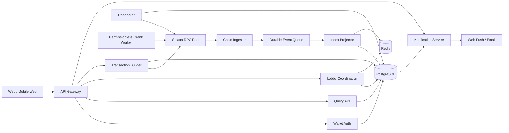

# Backend, Database, and Indexing Architecture

## Role and trust model

The backend improves public-lobby discovery, private-invite resolution, seat
presence, transaction construction, notifications, and query performance. It
does not perform automatic PvP matchmaking. It is not authoritative for
balances, locked funds, moves, deadlines, winners, fees, withdrawals, or
payouts. PostgreSQL and Redis are projections of Solana state; disagreement is
resolved in favor of the configured on-chain program and finalized account data.

The backend never:

- holds player private keys or signs as a player;
- owns an escrow authority;
- changes a funded rules snapshot;
- marks a payout final without on-chain evidence;
- depends on one privileged crank key for liveness;
- accepts a client-provided winner, fee, pot, or payout as truth.

## Service map



Logical services may begin as modules in one deployable application. Boundaries
should remain explicit so indexing and reconciliation can scale independently.

| Service              | Responsibility                                                                                    | Scaling / failure posture                              |
| -------------------- | ------------------------------------------------------------------------------------------------- | ------------------------------------------------------ |
| API gateway          | TLS, request IDs, rate limits, schema validation                                                  | Stateless, horizontally scaled                         |
| Wallet auth          | Nonce issuance and signature verification                                                         | PostgreSQL-backed nonce replay protection              |
| Query API            | Read-optimized match, profile, leaderboard, and activity endpoints                                | Cacheable; stale data carries chain watermark          |
| Lobby coordination   | Public/private lobby metadata, expiring seat leases, ready presence, and secure invite resolution | PostgreSQL audit record plus disposable Redis presence |
| Transaction builder  | Builds unsigned versioned transactions and explains expected effects                              | Re-simulates; client remains signer                    |
| Chain ingestor       | Subscribes to program logs/accounts across RPC providers                                          | Resumable from durable cursor                          |
| Index projector      | Applies canonical chain facts transactionally                                                     | At-least-once input, idempotent output                 |
| Reconciler           | Detects missed events, fork effects, and accounting drift                                         | Periodic and on-demand                                 |
| Crank worker         | Submits permissionless phase/settlement instructions                                              | Replaceable; no special authority                      |
| Notification service | Delivers non-authoritative status updates                                                         | Outbox-driven, retry-safe                              |

## Typed API

Use HTTPS JSON with an OpenAPI contract generated from shared schemas. Monetary
fields, slots, and large counters are decimal strings, never JavaScript numbers.
Public keys are base58 strings. Timestamps are RFC 3339 for display; on-chain
slot and Unix time remain separately available.

### Response envelope

```ts
type ApiSuccess<T> = {
  data: T;
  meta: {
    requestId: string;
    cluster: "devnet" | "mainnet-beta";
    indexedSlot: string;
    commitment: "confirmed" | "finalized";
  };
};

type ApiError = {
  error: {
    code: string;
    message: string;
    retryable: boolean;
    fieldErrors?: Record<string, string>;
    chain?: { signature?: string; programError?: string };
  };
  meta: { requestId: string };
};
```

### Principal resources

| Method and route                                          | Auth                         | Purpose                                                       |
| --------------------------------------------------------- | ---------------------------- | ------------------------------------------------------------- |
| `POST /v1/auth/challenges`                                | Public, rate-limited         | Issue domain-bound wallet challenge                           |
| `POST /v1/auth/sessions`                                  | Wallet signature             | Verify challenge and issue short-lived session                |
| `DELETE /v1/auth/session`                                 | Session                      | Revoke current session                                        |
| `GET /v1/config`                                          | Public                       | Supported cluster, program ID, active rules, feature flags    |
| `GET /v1/rules/{version}`                                 | Public                       | Human-readable canonical rules projection and hash            |
| `GET /v1/matches`                                         | Optional                     | Filtered, cursor-paginated discovery                          |
| `GET /v1/matches/{matchPda}`                              | Optional                     | Match, seats, rounds, payouts, finality watermark             |
| `POST /v1/lobbies`                                        | Session                      | Create public/private waiting lobby metadata; no funds move   |
| `GET /v1/lobbies/public`                                  | Optional                     | Filtered card-based public lobby discovery                    |
| `POST /v1/lobbies/resolve-invite`                         | Session, rate-limited        | Resolve a secure private code without granting fund authority |
| `POST /v1/lobbies/{lobbyId}/seats`                        | Session                      | Acquire an expiring available-seat lease                      |
| `DELETE /v1/lobbies/{lobbyId}/seats/me`                   | Session                      | Leave before funding with no balance change                   |
| `POST /v1/lobbies/{lobbyId}/ready/build`                  | Session                      | Build match-specific ready consent; no funds move             |
| `POST /v1/matches/{matchPda}/build-fund`                  | Coordinator                  | Build one all-participant atomic funding instruction          |
| `POST /v1/matches/{matchPda}/rounds/{round}/build-commit` | Session                      | Return unsigned commit transaction                            |
| `POST /v1/matches/{matchPda}/rounds/{round}/build-reveal` | Session                      | Return unsigned reveal transaction                            |
| `POST /v1/matches/{matchPda}/build-crank`                 | Session or public throttle   | Return permissionless advance transaction                     |
| `POST /v1/balance/build-deposit`                          | Session                      | Return owner deposit transaction intent                       |
| `POST /v1/balance/build-withdraw`                         | Session plus wallet approval | Return owner-only partial/full available withdrawal intent    |
| `GET /v1/players/{wallet}`                                | Public                       | Public profile and finalized statistics                       |
| `GET /v1/players/{wallet}/activity`                       | Owner/public subset          | Cursor-paginated activity                                     |
| `POST /v1/transactions/{signature}/observe`               | Session                      | Expedite observation; never asserts success                   |
| `GET /v1/transactions/{signature}`                        | Optional                     | Indexed confirmation, error, and finality                     |

Every mutating HTTP request accepts `Idempotency-Key`. The key is scoped to
wallet, route, and canonical request hash. Reusing a key with a different
payload returns `409 IDEMPOTENCY_CONFLICT`.

### Transaction-builder response

The builder returns:

- base64 unsigned transaction;
- recent blockhash and expiry block height;
- expected signer public keys;
- decoded instruction summary;
- estimated network fee and stake transfer;
- program ID, match PDA, and rules snapshot hash;
- simulation result and structured warnings.

The client must decode and verify this summary against its own intended action
before signing. The server cannot silently substitute a treasury, match, stake,
or payout destination.

## PostgreSQL schema

Use PostgreSQL 16 or later. `bytea` stores decoded 32-byte public keys when
compact indexing matters; API-facing base58 values may be generated at
boundaries. Lamports use `numeric(20,0)` or checked signed `bigint`. The schema
below uses `numeric(20,0)` to represent the complete `u64` range.

### Identity and authentication

| Table              | Important columns                                                                                        | Keys, constraints, and indexes                                                                                                                      |
| ------------------ | -------------------------------------------------------------------------------------------------------- | --------------------------------------------------------------------------------------------------------------------------------------------------- |
| `wallets`          | `address bytea`, `created_at`, `last_seen_at`                                                            | PK `address`; check `octet_length(address)=32`                                                                                                      |
| `auth_challenges`  | `id uuid`, `wallet bytea`, `nonce_hash bytea`, `domain`, `statement`, `expires_at`, `used_at`            | PK `id`; FK wallet; unique `nonce_hash`; index `(wallet, expires_at desc)`; check `used_at IS NULL OR used_at <= expires_at + interval '5 minutes'` |
| `sessions`         | `id uuid`, `wallet bytea`, `token_hash bytea`, `expires_at`, `revoked_at`                                | PK `id`; unique `token_hash`; FK wallet; partial index `(wallet, expires_at)` where `revoked_at IS NULL`                                            |
| `idempotency_keys` | `wallet bytea`, `route`, `key`, `request_hash`, `status`, `response_code`, `response_body`, `expires_at` | PK `(wallet, route, key)`; index `expires_at`; status check                                                                                         |

### Profiles, preferences, moderation, and growth

| Table                 | Important columns                                                                                                                         | Keys, constraints, and indexes                                                                                      |
| --------------------- | ----------------------------------------------------------------------------------------------------------------------------------------- | ------------------------------------------------------------------------------------------------------------------- |
| `profiles`            | `wallet`, `username_display`, `username_normalized`, `username_skeleton`, `avatar_id`, `joined_at`, `rename_available_at`, privacy fields | PK/FK wallet; unique normalized and confusable skeleton indexes; length/content checks                              |
| `username_history`    | `id`, `wallet`, old/new display and normalized values, `changed_at`, moderation reason                                                    | Append-only; indexes by wallet and normalized value                                                                 |
| `avatars`             | `id`, asset/config key, enabled, sort order, metadata                                                                                     | PK; built-in allowlist only for v1                                                                                  |
| `wager_presets`       | `wallet`, four integer-lamport values, `updated_at`                                                                                       | PK/FK; positive/min/max checks; convenience only                                                                    |
| `player_statistics`   | `cluster`, `wallet`, mode, completed/wins/losses, streaks, lifetime wager/winnings/fees, largest win                                      | PK `(cluster,wallet,mode)`; projection version/finalized slot; fully rebuildable                                    |
| `leaderboard_entries` | `cluster`, board key, wallet, value, rank projection, qualified matches, computed slot                                                    | Unique `(cluster,board_key,wallet)`; indexes for board/value; practice and test/mainnet namespaces cannot mix       |
| `profile_moderation`  | case ID, wallet, action, reason, actor, approvals, starts/ends                                                                            | Append-only audit; no financial authority                                                                           |
| `referrals`           | code hash, referrer wallet, referred wallet, created time, first legitimate match, qualification, suspicious/reversed state               | Unique code and referred wallet under policy; self/circular constraints plus risk review; no payout columns enabled |
| `spectator_sessions`  | opaque session ID, match, coarse dedupe key, last seen, expiry                                                                            | Short retention; approximate counts only; no precise presence authority                                             |
| `feature_flags`       | key, environment, enabled/config, owner, review expiry, updated by                                                                        | Audited; financial flags fail closed and cannot override program authorization                                      |
| `status_incidents`    | ID, operational state, affected components, message, starts/ends, updates                                                                 | Public-safe projection with immutable update history                                                                |

### Chain and game projection

| Table                  | Important columns                                                                                                                                                                                                                                 | Keys, constraints, and indexes                                                                                                                                                                                                                        |
| ---------------------- | ------------------------------------------------------------------------------------------------------------------------------------------------------------------------------------------------------------------------------------------------- | ----------------------------------------------------------------------------------------------------------------------------------------------------------------------------------------------------------------------------------------------------- |
| `chain_blocks`         | `cluster`, `slot numeric(20,0)`, `blockhash bytea`, `parent_slot`, `block_time`, `status`                                                                                                                                                         | PK `(cluster, slot, blockhash)`; index `(cluster, status, slot desc)`                                                                                                                                                                                 |
| `chain_transactions`   | `cluster`, `signature bytea`, `slot`, `blockhash`, `success`, `error jsonb`, `finality`, `observed_at`                                                                                                                                            | PK `(cluster, signature)`; index `(cluster, slot desc)`; partial index failed transactions                                                                                                                                                            |
| `program_events`       | `cluster`, `signature`, `instruction_index`, `event_index`, `slot`, `event_type`, `match_pda`, `sequence`, `payload jsonb`, `canonical`                                                                                                           | PK `(cluster, signature, instruction_index, event_index)`; index `(match_pda, sequence)`; index `(cluster, slot)`; GIN on payload only if measured queries justify it                                                                                 |
| `rules_versions`       | `cluster`, `program_id`, `version`, `account`, `snapshot_hash`, `snapshot jsonb`, `published_slot`                                                                                                                                                | PK `(cluster, program_id, version)`; unique `(cluster, account)`; unique snapshot hash per program/version policy                                                                                                                                     |
| `matches`              | `cluster`, `match_pda`, `program_id`, `creator`, `client_match_id`, `mode`, `state`, `rules_version`, `rules_hash`, `stake_lamports`, `fee_bps`, `treasury`, `current_round`, `terminal_reason`, `created_slot`, `updated_slot`, `finalized_slot` | PK `(cluster, match_pda)`; unique `(cluster, creator, client_match_id)`; checks stake `>0`, fee `BETWEEN 0 AND 500`, valid mode/state; indexes `(cluster, state, created_slot desc)`, `(creator, created_slot desc)`, `(mode, state, stake_lamports)` |
| `match_players`        | `cluster`, `match_pda`, `seat`, `wallet`, `payout_wallet`, `team`, `funded_lamports`, `funded_slot`, `claim_state`, `payout_lamports`                                                                                                             | PK `(cluster, match_pda, seat)`; FK match; unique `(cluster, match_pda, wallet)`; checks seat `0..3`, nonnegative values; indexes `(wallet, funded_slot desc)`, `(match_pda, team)`                                                                   |
| `rounds`               | `cluster`, `match_pda`, `round_no`, `phase`, `commit_deadline`, `reveal_deadline`, `result`, `resolved_slot`                                                                                                                                      | PK `(cluster, match_pda, round_no)`; FK match; check round `>0`; index unresolved deadlines                                                                                                                                                           |
| `round_actions`        | `cluster`, `match_pda`, `round_no`, `seat`, `commitment`, `move`, `commit_slot`, `reveal_slot`, `timeout_kind`                                                                                                                                    | PK `(cluster, match_pda, round_no, seat)`; FK round; check move domain; partial index where reveal is missing                                                                                                                                         |
| `settlements`          | `cluster`, `match_pda`, `receipt_pda`, `gross_pot`, `fee_lamports`, `distributable`, `terminal_reason`, `initialized_slot`, `completed_slot`                                                                                                      | PK `(cluster, match_pda)`; unique receipt; checks values nonnegative and `fee + distributable = gross_pot`                                                                                                                                            |
| `settlement_transfers` | `cluster`, `match_pda`, `kind`, `seat`, `destination`, `amount`, `paid_signature`, `paid_slot`                                                                                                                                                    | PK `(cluster, match_pda, kind, seat)` with sentinel seat for fee; FK settlement; unique on-chain receipt identity; check amount nonnegative; partial index unpaid transfers                                                                           |
| `account_snapshots`    | `cluster`, `address`, `slot`, `write_version`, `owner`, `lamports`, `data_hash`, `decoded jsonb`, `canonical`                                                                                                                                     | PK `(cluster, address, slot, write_version)`; index latest canonical snapshot by address                                                                                                                                                              |

Cross-table payout conservation is enforced in a deferred constraint trigger or
reconciliation query because SQL `CHECK` constraints cannot reference other
rows. Projection writes for one event occur in one database transaction and
advance the cursor only after commit.

### Matchmaking, notifications, and operations

| Table                      | Important columns                                                                                                                               | Keys, constraints, and indexes                                                                                                                      |
| -------------------------- | ----------------------------------------------------------------------------------------------------------------------------------------------- | --------------------------------------------------------------------------------------------------------------------------------------------------- |
| `lobbies`                  | `id uuid`, `visibility`, `creator_wallet`, `mode`, `wager_lamports`, `rules_version`, `spectators_allowed`, `status`, `expires_at`, `match_pda` | PK; visibility check public/private; immutable terms after first occupied seat; public discovery index `(status, mode, wager_lamports, created_at)` |
| `lobby_seats`              | `lobby_id`, `seat`, `wallet`, `team`, `lease_expires_at`, `ready_state`, `ready_consent_pda`                                                    | PK `(lobby_id, seat)`; unique `(lobby_id, wallet)`; partial lease-expiry index; team/seat checks                                                    |
| `private_invites`          | `id uuid`, `lobby_id`, `code_hash`, `expires_at`, `consumed_or_closed_at`, `attempt_bucket`                                                     | PK; unique high-entropy `code_hash`; never store raw code after issuance; lobby-close/expiry invalidation                                           |
| `notification_preferences` | `wallet`, channels and event flags                                                                                                              | PK/FK wallet                                                                                                                                        |
| `notification_outbox`      | `id bigserial`, `dedupe_key`, `wallet`, `kind`, `payload`, `available_at`, `attempts`, `sent_at`                                                | PK; unique dedupe key; partial index `(available_at)` where unsent                                                                                  |
| `indexer_cursors`          | `consumer`, `cluster`, `last_slot`, `last_signature`, `updated_at`                                                                              | PK `(consumer, cluster)`                                                                                                                            |
| `reconciliation_runs`      | `id uuid`, `cluster`, `scope`, `from_slot`, `to_slot`, `status`, counts, `started_at`, `completed_at`                                           | PK; index `(cluster, started_at desc)`                                                                                                              |
| `reconciliation_findings`  | `run_id`, `entity_type`, `entity_id`, `severity`, `code`, `expected jsonb`, `actual jsonb`, `resolved_at`                                       | Composite PK; FK run; partial index unresolved findings                                                                                             |

## Redis usage

Redis is disposable acceleration, never a source of financial truth.

| Key pattern                            | Data type            | TTL / behavior                                                 |
| -------------------------------------- | -------------------- | -------------------------------------------------------------- |
| `rps:config:{cluster}`                 | JSON string          | 30–60 seconds                                                  |
| `rps:match:{cluster}:{pda}`            | JSON string          | Short TTL; invalidated by projector                            |
| `rps:lobby:{lobbyId}:presence`         | Sorted set           | Expiring seat/session presence only; no fund authority         |
| `rps:lobby:{lobbyId}:seat-lock:{seat}` | Lease                | Short owner-token compare-and-delete lock for concurrent joins |
| `rps:rate:{scope}:{subject}`           | Counter/token bucket | Route-specific                                                 |
| `rps:ws:{wallet}`                      | Pub/Sub or Streams   | Ephemeral updates; clients always refetch                      |

Seat assignment is persisted in PostgreSQL before clients are notified. Redis
loss may expire presence and reopen a waiting seat, but cannot debit a balance,
alter a funded match, or grant access to a private lobby.

## Indexing pipeline

### Ingestion and finality

1. Subscribe to program logs and relevant account changes at `confirmed`.
2. Persist raw transaction/event identity before projection.
3. Decode using the program and account schema version active at that slot.
4. Apply events in `(slot, transaction_index, instruction_index, event_index)`
   order.
5. Maintain both observed confirmation and finalized watermark.
6. Mark forked records noncanonical and rebuild affected projections from the
   last finalized checkpoint.

At-least-once delivery is assumed. The natural event primary key makes duplicate
ingestion a no-op. A match event sequence gap schedules immediate account
reconciliation.

### Idempotent projection

For each event, one PostgreSQL transaction:

```text
INSERT program_event ... ON CONFLICT DO NOTHING
if inserted:
  lock projected match row
  require event.sequence = current_sequence + 1
  apply deterministic state transition
  upsert dependent rows
  enqueue deduplicated notifications
  update cursor
COMMIT
```

If the event already exists, the projector acknowledges it without reapplying
side effects. If sequence or decoded values conflict with the current on-chain
account, projection stops for that entity and opens a reconciliation finding
rather than guessing.

## Reconciliation

Reconciliation is mandatory because WebSocket streams and RPC providers can omit
or reorder data.

| Cadence           | Scope                      | Checks                                                      |
| ----------------- | -------------------------- | ----------------------------------------------------------- |
| Continuous        | Every changed match        | Account hash, state, sequence, round, funding bitmap        |
| Every few minutes | Active matches             | Deadlines, vault balance, player slots, missing events      |
| Hourly            | Recently terminal matches  | Settlement receipt, payout bits, fee transfer, conservation |
| Daily             | Full bounded scan          | PDA inventory, orphan accounts, PostgreSQL drift            |
| On demand         | Match/signature/slot range | Incident investigation and repair                           |

For a match, the reconciler fetches all PDAs at a consistent commitment,
verifies owners and derivations, decodes raw bytes, and compares:

```text
vault_balance + completed_outflows
  == total_funded + unattributed_direct_deposits
sum(planned_transfers) == gross_pot
sum(completed_transfer_rows) == on-chain paid bitmap/receipts
```

Repairs are idempotent database reprojections from canonical chain data. The
reconciler does not send corrective money movements. If an eligible on-chain
crank is missing, it may enqueue a permissionless crank transaction, which the
program independently validates.

## Security and operations

- Use multiple RPC providers with health, lag, and disagreement metrics.
- Pin the expected program ID per cluster and reject account owner mismatches.
- Store service secrets in a managed secret store; no player seed phrases or
  private keys.
- Use a low-balance operational key only for optional crank transaction fees.
- Apply wallet-signature challenges with domain, URI, chain, nonce, issued-at,
  and expiry binding.
- Rate-limit challenge issuance, transaction simulation, lobby creation/join,
  private invite resolution, seat renewal, and expensive list queries.
- Use row-level access rules in service code and separate read/write database
  roles.
- Encrypt backups and sensitive notification endpoints; minimize retained
  IP/device data.
- Trace every API request through builder, signature observation, event, and
  projection using stable correlation IDs.

Essential alerts cover indexer lag, finalized-slot lag, event sequence gaps, RPC
disagreement, reconciliation drift, vault conservation failures, stuck outbox
messages, crank balance, and elevated transaction simulation errors.

## Availability behavior

If the backend is unavailable, players can still use any compatible client or
direct program instruction to reveal, resolve, settle, and withdraw. If indexing
is delayed, the UI must label data as stale and offer direct RPC refresh.
Backend recovery consists of replaying finalized chain history and rebuilding
disposable caches; it never requires reconstructing financial truth from
application logs.
