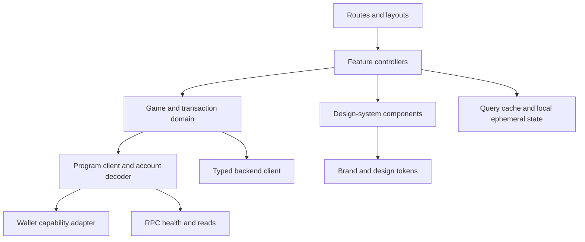
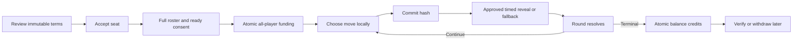

# Frontend Architecture and Design System

## Product principles

The interface must make a wager understandable before it is signed, make
commit–reveal phases unmistakable during play, and never present backend state
as more authoritative than the chain. The visual character may be energetic, but
monetary amounts, deadlines, wallet permissions, transaction status, and failure
recovery remain calm and explicit.

Recommended stack: strict TypeScript, current stable Next.js/React, the official
`@solana/react-hooks` and `@solana/client` direction with Wallet Standard
auto-discovery, TanStack Query where it adds value, Zod validation, accessible
headless primitives, and CSS custom properties generated from design tokens. The
Solana integration remains behind an adapter because these APIs evolve. Chain
decoding and transaction verification live in a framework-neutral protocol
package.

## Route map

| Route                        | Access                                          | Primary content                                                                      |
| ---------------------------- | ----------------------------------------------- | ------------------------------------------------------------------------------------ |
| `/`                          | Public                                          | Home, product explanation, real indexed public matches only, Guide and Play actions  |
| `/play`                      | Public / wallet-enhanced                        | Prominent `[ PRACTICE ] [ PLAY WITH SOL ]` control, mode selection, exact separation |
| `/practice`                  | Public                                          | Unlimited local CPU practice; no wallet/deposit/stat effects                         |
| `/lobby/public`              | Public                                          | Card-based public lobbies and required filters; no automatic matchmaking             |
| `/game/private`              | Public / wallet-enhanced                        | Create private lobby or resolve invite code/link                                     |
| `/lobbies/[lobbyId]`         | Authenticated participant / permitted spectator | Seats, teams, ready state, exact terms, no-debit explanation                         |
| `/matches/[matchPda]`        | Public when eligible                            | Canonical active match or spectator presentation                                     |
| `/matches/[matchPda]/verify` | Public                                          | Program, rules, commitments, reveals/fallbacks, calculations, credits, settlement    |
| `/watch`                     | Public                                          | Real indexed spectatable public matches only                                         |
| `/leaderboards`              | Public                                          | Finalized wager statistics; never called Ranked                                      |
| `/history`                   | Wallet-enhanced                                 | Connected player's match history                                                     |
| `/profiles/[username]`       | Public                                          | Profile, truncated wallet, statistics and recent matches                             |
| `/profile`                   | Connected wallet                                | Own profile, active match, presets, settings                                         |
| `/guide`                     | Public                                          | Game Guide, rules, diagrams, fees, balances, timeouts, FAQ                           |
| `/fairness`                  | Public                                          | Commit-reveal, fallback, settlement, and verification explanation                    |
| `/security`                  | Public                                          | Plain-English security and anti-phishing guidance                                    |
| `/balance`                   | Connected wallet                                | On-chain available/locked/credited accounting and receipts                           |
| `/deposit`                   | Connected wallet; gated                         | Exact devnet-only deposit review when enabled                                        |
| `/withdraw`                  | Connected owner; gated                          | Owner-only partial/full available withdrawal review                                  |
| `/status`                    | Public                                          | RPC, indexer, lobby, spectator, game-pause, withdrawal states                        |
| `/admin`                     | Protected and disabled in preview               | Limited operational controls; never outcome/payout control                           |
| `/transactions/[signature]`  | Public                                          | Transaction lifecycle, decoded effect, explorer link                                 |
| `/support`                   | Public                                          | FAQ, troubleshooting, contact, responsible play                                      |
| `/legal/terms`               | Public                                          | Terms                                                                                |
| `/legal/privacy`             | Public                                          | Privacy                                                                              |
| `/legal/risk`                | Public                                          | Wagering, smart-contract, network, and jurisdiction risks                            |
| `/404`                       | Public                                          | Not found with safe navigation                                                       |

The match route is one durable URL. Phase changes replace panels in place rather
than navigating players through fragile step-specific URLs. There is no
automatic PvP matchmaking, unlisted-game route, public chat, Ranked route,
season route, reputation route, or wagered CPU route. Query parameters may
encode non-sensitive filters, but never salts, unrevealed moves, invite secrets,
session material, or signed transactions.

## Application layers



- **Chain reads:** canonical match accounts, vault, slots, receipts, balances,
  and signatures.
- **Backend reads:** discovery, search, profiles, notifications, and indexed
  history, always labeled with an indexed slot.
- **Local ephemeral state:** selected move, secret salt, pending signature,
  preferences. Unrevealed move material is never sent to analytics or backend
  APIs.
- **Derived state:** phase labels, payout preview, countdowns, and eligibility
  are pure functions of decoded accounts and immutable rules.

## Centralized branding and tokens

All brand values live in a versioned token package, exported as typed TypeScript
values, CSS custom properties, and design-tool JSON. Product code must not
introduce raw colors, spacing, radii, shadows, font families, or animation
durations.

### Brand foundation

| Token             | Value / intent                                       |
| ----------------- | ---------------------------------------------------- |
| `brand.name`      | `RPS`                                                |
| `brand.voice`     | Direct, competitive, transparent, never casino-hyped |
| `font.display`    | `"Geist", system-ui, sans-serif`                     |
| `font.body`       | `"Geist", system-ui, sans-serif`                     |
| `font.mono`       | `"Geist Mono", ui-monospace, monospace`              |
| `color.brand.500` | `#D7FF43` replaceable primary accent                 |
| `color.brand.600` | `#C3ED2C` primary hover                              |
| `color.move`      | Neutral surface/text; icon and label carry identity  |
| `color.success`   | `#2EB67D`                                            |
| `color.warning`   | `#F2A93B`                                            |
| `color.danger`    | `#E55353`                                            |
| `color.info`      | `#4C8DFF`                                            |

Semantic tokens reference the palette and have separate light, dark, and
high-contrast mappings:

```text
--surface-canvas
--surface-raised
--surface-overlay
--text-primary
--text-secondary
--text-inverse
--border-subtle
--border-strong
--action-primary
--action-primary-hover
--focus-ring
--status-success
--status-warning
--status-danger
```

### Scales

| Category    | Tokens                                                                                  |
| ----------- | --------------------------------------------------------------------------------------- |
| Spacing     | `space.0`, `1=4px`, `2=8px`, `3=12px`, `4=16px`, `5=24px`, `6=32px`, `7=48px`, `8=64px` |
| Radius      | `none`, `sm=6px`, `md=10px`, `lg=16px`, `pill=999px`                                    |
| Type        | `xs=12/16`, `sm=14/20`, `md=16/24`, `lg=20/28`, `xl=28/36`, `2xl=40/48`                 |
| Elevation   | `none`, `raised`, `popover`, `modal`; visible borders remain in high contrast           |
| Motion      | `instant=0`, `fast=120ms`, `base=200ms`, `slow=320ms`                                   |
| Layout      | `content=1200px`, `reading=720px`, `touchTarget=44px`, `header=64px`                    |
| Breakpoints | `sm=480px`, `md=768px`, `lg=1024px`, `xl=1280px`                                        |
| Layering    | base, sticky, dropdown, overlay, modal, toast; named tokens only                        |

Token contrast is tested to WCAG 2.2 AA: normal text at least 4.5:1, large text
3:1, and essential non-text UI 3:1.

## Reusable component inventory

### Foundations and navigation

| Component                            | Responsibilities                                                        |
| ------------------------------------ | ----------------------------------------------------------------------- |
| `AppShell`                           | Header, responsive navigation, network banner, content landmark, footer |
| `BrandMark`                          | Approved lockups, accessible name, monochrome fallback                  |
| `TopNavigation`                      | Desktop links, active route, wallet entry                               |
| `MobileNavigation`                   | Focus-managed drawer/bottom navigation                                  |
| `Breadcrumbs`                        | Hierarchy and structured data on public pages                           |
| `PageHeader`                         | Title, description, status, actions                                     |
| `Section`, `Stack`, `Inline`, `Grid` | Token-constrained layout primitives                                     |
| `Divider`                            | Semantic visual separation                                              |

### Actions, forms, and overlays

| Component                                               | Responsibilities                                           |
| ------------------------------------------------------- | ---------------------------------------------------------- |
| `Button`, `IconButton`, `ButtonGroup`                   | Primary/secondary/quiet/danger, busy and disabled states   |
| `Link`                                                  | Internal/external treatment and external-link announcement |
| `TextField`, `TextArea`                                 | Labels, descriptions, inline errors                        |
| `NumberField`                                           | Locale-aware entry; converts SOL display to exact lamports |
| `StakeInput`                                            | Balance, presets, network fee reserve, min/max validation  |
| `Select`, `RadioGroup`, `Checkbox`, `Switch`            | Keyboard-complete form controls                            |
| `SegmentedControl`                                      | Mode/filter choices; not a substitute for tabs             |
| `FormField`, `FieldError`, `FormSummary`                | Unified validation and focus-to-error                      |
| `Dialog`, `AlertDialog`, `Drawer`, `Popover`, `Tooltip` | Focus trapping/restoration and escape behavior             |
| `CopyButton`                                            | Public key/signature copy with live-region confirmation    |

### Wallet and transaction components

| Component                 | Responsibilities                                                       |
| ------------------------- | ---------------------------------------------------------------------- |
| `WalletButton`            | Connect/disconnect/account menu without implying authorization         |
| `WalletPicker`            | Installed, deep-link, QR, hardware, and unsupported classifications    |
| `WalletStatus`            | Connected account, tested-support label, network and capability state  |
| `WalletIdentity`          | Identicon, shortened address, copy, explorer link                      |
| `NetworkBadge`            | Cluster and mismatch warning                                           |
| `BalanceDisplay`          | SOL/lamport-safe formatting and freshness                              |
| `BalanceCard`             | Available, locked, credited winnings, and projected/on-chain freshness |
| `WagerPresets`            | Four editable personal presets plus custom exact-lamport input         |
| `SignatureRequest`        | Human-readable reason for message signature                            |
| `TransactionReview`       | Program, instruction, stake, fee, destinations, rules hash             |
| `TransactionStatus`       | Lifecycle stepper from preparation through finality                    |
| `TransactionReceipt`      | Signature, slot, effect, amounts, explorer, retry-safe actions         |
| `PendingTransactionsTray` | Persistent status across routes/reloads                                |

### Game components

| Component                                  | Responsibilities                                                              |
| ------------------------------------------ | ----------------------------------------------------------------------------- |
| `ModeCard`, `ModePicker`                   | Compare player count, team model, win condition                               |
| `RulesSummary`                             | Version, fee, timers, tie safety, expandable full snapshot                    |
| `FeeBreakdown`                             | Gross pot, integer fee, distributable amount, payout preview                  |
| `MatchCard`, `MatchList`, `MatchFilters`   | Discovery and status                                                          |
| `PlayerCard`, `ProfileCard`                | Avatar, username, truncated wallet, supported public statistics               |
| `MatchHeader`                              | Match code, mode, stake, rules version, chain freshness                       |
| `SeatGrid`, `PlayerSeat`                   | Wallet, team, funding, commit/reveal, result state                            |
| `TeamPanel`, `SeatState`                   | Team score/members and all Available→Completed seat states                    |
| `MatchTimeline`                            | Lobby, funding, commit, reveal, settlement progression                        |
| `PhaseBanner`                              | Current required action and consequence                                       |
| `CountdownTimer`                           | Slot/time estimate with exact deadline and stale-clock warning                |
| `MovePicker`, `MoveCard`                   | Rock/paper/scissors controls with text labels                                 |
| `CommitmentGuard`                          | Salt persistence check and commitment explanation                             |
| `RevealPrompt`                             | Selected move confirmation and recovery path                                  |
| `RoundBoard`, `RoundHistory`, `ScoreBoard` | Current and prior deterministic outcomes                                      |
| `LifeIndicator`                            | Text/icon life count for 1v1v1v1; never color-only                            |
| `RevealAnimation`, `OutcomeAnimation`      | Restrained move/round/match reveal with reduced-motion alternative            |
| `OpponentStatus`                           | Only allowed phase metadata; never leaks hidden moves                         |
| `SettlementPanel`                          | Winner/refund state, payout plan, withdrawal action                           |
| `CollectWinningsAck`                       | Acknowledges an already credited balance; never requests a wallet transaction |
| `ShareMatch`                               | Safe link/QR without secret query data                                        |
| `SpectatorBanner`, `SpectatorCount`        | Read-only state and clearly approximate deduplicated count                    |
| `ExplorerLink`, `VerifyMatchLink`          | Network-correct external evidence and plain-English verification              |

### Feedback, data, and safety

| Component                    | Responsibilities                                                              |
| ---------------------------- | ----------------------------------------------------------------------------- |
| `Alert`, `Banner`, `Toast`   | Severity semantics; toasts never carry the only critical information          |
| `SystemStatusBanner`         | Non-production, degraded, paused, read-only, maintenance and emergency states |
| `StatusBadge`                | Text + icon + color status encoding                                           |
| `EmptyState`                 | Clear next action                                                             |
| `Skeleton`                   | Structure-preserving loading with reduced-motion behavior                     |
| `InlineSpinner`              | Supplementary busy indicator with text                                        |
| `ErrorState`                 | Specific cause, retained context, recovery choices                            |
| `ErrorBoundary`              | Route/feature isolation and diagnostic ID                                     |
| `DataTable`                  | Responsive, sortable, captioned, keyboard-accessible tables                   |
| `Pagination`                 | Cursor-based navigation                                                       |
| `FreshnessIndicator`         | RPC/indexer slot and stale state                                              |
| `RulesCallout`, `RiskNotice` | Contextual rule, fee, locking, wagering, and network explanation              |
| `ResponsiblePlayPanel`       | Limits, cooldown guidance, support links                                      |

Every component documents anatomy, variants, states, keyboard behavior,
screen-reader output, responsive behavior, and usage examples in an isolated
component workbench.

## Wallet support classifications

Support is capability-based, not brand-assumed. Wallet capabilities are detected
at runtime and shown before the player enters a funded flow.

| Classification                               | Examples / transport                     | Support level               | Required behavior                                                          |
| -------------------------------------------- | ---------------------------------------- | --------------------------- | -------------------------------------------------------------------------- |
| Browser extension / injected standard wallet | Wallet Standard providers                | Full                        | Connect, message-sign auth, legacy/versioned transaction signing           |
| Mobile in-app browser                        | Wallet-provided browser                  | Full when capabilities pass | Preserve match and pending transaction state                               |
| Mobile Wallet Adapter                        | Android-compatible remote wallet         | Full where available        | Association lifecycle, foreground recovery                                 |
| QR / remote session                          | WalletConnect-compatible Solana provider | Conditional                 | Clearly label session expiry and supported transaction versions            |
| Deep-link mobile wallet                      | Registered universal/custom link         | Conditional                 | Return URL and transaction expiry recovery                                 |
| Hardware wallet                              | Through a compatible host wallet         | Supported with limitations  | Avoid mandatory message signing where unsupported; explain manual approval |
| Embedded/custodial wallet                    | Standards-compliant provider             | Conditional                 | Disclose custody model; same transaction verification                      |
| Watch-only address                           | Manual public key                        | Read-only                   | Spectate/profile only; cannot accept/fund/play                             |
| Unsupported wallet                           | Missing required capabilities            | Block funded action only    | Explain missing capability and offer supported options                     |

Minimum funded-play capabilities are account connection and signing the
transaction format built by the app. Message signing is required only for
optional backend sessions; core on-chain play remains possible without it.
Wallet installation, connection, authentication, network selection, and
transaction authorization are distinct states in copy and UI.

Initial classification policy:

- Phantom and Solflare: target **Tested** only after extension, mobile
  deep-link, in-wallet browser, message-sign, and transaction suites pass.
- MetaMask: advertise as **Tested** only when Solana Wallet Standard capability
  is actually exposed and passes the same suite; otherwise show detected but not
  fully tested.
- Other Wallet Standard providers: **Detected but not fully tested** until the
  compatibility matrix passes, available through **More Wallets**.
- Rabby: do not advertise unless native Solana connection and signing are
  confirmed by real tests.
- Missing required capabilities: **Unsupported** for funded play while read-only
  pages remain available.

## Primary match experience



Before ready consent, `TransactionReview` repeats wager per player, player
count, total pot, fee basis points and lamports, exact potential payout, timers,
tie/fallback rules, version/hash, program ID, and owner wallet. The UI states
that joining and readying do not lock funds; the coordinator's later
all-participant transaction either locks every wager or none.

The selected move and salt are stored locally in encrypted-at-rest browser
storage where available, namespaced by cluster, program, match, round, and
wallet. The interface offers an exportable recovery blob before commit. It warns
that clearing site data before reveal may cause a timeout loss. Analytics must
never capture move controls, salt, recovery blob, or commitment preimages.

## Transaction lifecycle

`TransactionStatus` exposes the required stable product states (internal
substeps may be more detailed):

| State                    | User-facing meaning                                      | Available action                       |
| ------------------------ | -------------------------------------------------------- | -------------------------------------- |
| Awaiting wallet approval | No transaction exists yet                                | Open wallet or cancel                  |
| Submitted                | Signature exists; success is unknown                     | View signature; do not duplicate       |
| Processing               | Cluster observed below required confirmation             | Wait and reconcile                     |
| Confirmed                | Required confirmation reached and account is re-read     | Continue according to operation policy |
| Finalized where required | Finality reached                                         | View receipt                           |
| Failed                   | Definitive chain/program error                           | Correct cause; no optimistic debit     |
| Rejected                 | Wallet declined                                          | Return to unchanged form               |
| Expired                  | Blockhash expired and reconciliation found no landing    | Build a fresh transaction              |
| Retrying                 | Identical idempotent transport/rebuild after safe expiry | Show attempt and preserve intent       |
| Reconciled               | Signature, account and index projection agree            | Complete                               |

Refreshing the page restores pending signatures and checks both signature status
and expected account change. An RPC timeout is not described as a failed wager.
The app must not build a duplicate financial transaction until it determines
whether the original landed; on-chain idempotency remains the final guard.

## Error model

Errors map to actionable, stable categories:

| Category               | Example                                           | Response                                                |
| ---------------------- | ------------------------------------------------- | ------------------------------------------------------- |
| Wallet                 | Rejected signature, disconnected, locked          | Preserve input; reconnect or retry                      |
| Network                | Wrong cluster, RPC unavailable, expired blockhash | Switch/rebuild; show status page                        |
| Program validation     | Phase closed, already committed, invalid seat     | Refresh canonical account and explain state             |
| Funds                  | Insufficient stake plus network fee               | Show exact shortfall                                    |
| Concurrency            | Another transaction advanced the match            | Refresh and treat already-completed action as success   |
| Indexing               | Backend behind chain                              | Use direct RPC state and mark history stale             |
| Local secret           | Commitment secret missing                         | Explain reveal risk; offer import recovery blob         |
| Unsupported capability | Wallet cannot sign required transaction           | Show compatible connection choices                      |
| Unexpected             | Decode/UI defect                                  | Safe error boundary, diagnostic ID, no secret telemetry |

Raw program errors are translated through a versioned error catalog but remain
expandable for support. Error messages never tell a user to “try again” when
doing so could duplicate a transfer without first checking state.

## Responsive and mobile behavior

- Design from a 320 CSS-pixel viewport upward; no critical horizontal scrolling.
- Use a single-column match flow on phones, two-column board and context panel
  on larger screens.
- Pin only the current required action to a safe-area-aware bottom action bar;
  never cover countdowns or errors.
- Minimum touch target is 44 by 44 CSS pixels with adequate spacing.
- Move selection uses equally sized labeled controls, not gesture-only input.
- Tables collapse into labeled cards while preserving all financial fields.
- Wallet deep-link return restores route, match, phase, and pending signature.
- Handle offline/online transitions, background timer throttling, virtual
  keyboard resizing, and orientation changes.
- Countdown calculations use chain deadline plus periodically calibrated cluster
  time; visual timers are estimates and never local authority.

## Accessibility

Target WCAG 2.2 AA.

- One visible `h1`, logical heading order, skip link, and semantic landmarks.
- Complete keyboard operation with visible focus; no focus traps outside modal
  primitives.
- Dialogs announce title/description and restore focus to their trigger.
- Move choices expose text and selected state; color, shape, and sound are
  redundant cues.
- Dynamic phase, transaction, and error changes use restrained `aria-live`
  regions; countdowns do not announce every second.
- At meaningful thresholds, the timer announces “one minute,” “thirty seconds,”
  and “ten seconds.”
- Public keys may be visually shortened but their accessible/copy value remains
  complete.
- Charts and score visuals have text equivalents.
- Form errors are associated with fields and summarized on submit.
- Zoom to 200% and text reflow to 400% do not remove actions or information.
- Automated accessibility checks run in components and routes, supplemented by
  keyboard and screen-reader testing.

## Reduced motion and audio

Respect `prefers-reduced-motion` on first visit and allow an in-app override.

| Experience             | Standard             | Reduced motion           |
| ---------------------- | -------------------- | ------------------------ |
| Route/panel transition | Short fade/translate | Instant or opacity-only  |
| Move reveal            | 200–320 ms reveal    | Immediate state swap     |
| Win celebration        | Brief particles      | Static success treatment |
| Countdown urgency      | Color/border change  | Same; never pulsing      |
| Skeleton               | Subtle shimmer       | Static placeholder       |

No essential state depends on animation.

Audio never starts loudly on page load and never encodes unique information.
Persist master mute and volume locally, with architecture for separate music and
effects levels. Desktop keeps a speaker button in the header: click toggles
mute, the icon reflects state, and hover or keyboard focus opens an accessible
slider. Mobile tap opens a compact touch-friendly panel with mute and slider.
Provide labeled countdown, selection, reveal, win, loss, and notification cues
only after user interaction. Screen-reader announcements remain independent of
audio settings.

## Testing and quality gates

- Visual regression for every component state in light, dark, and high-contrast
  themes.
- Unit/property tests for lamport formatting, fee previews, phase derivation,
  countdown thresholds, and error mapping.
- Contract tests against typed API schemas and program account fixtures for
  every supported schema version.
- End-to-end tests for each mode, wallet rejection, refresh during transaction,
  missing reveal secret, timeout, tie safety, payout retry, backend outage, and
  indexer lag.
- Accessibility checks with automated tools plus keyboard, VoiceOver, NVDA, and
  mobile screen-reader passes.
- Performance budgets for route JavaScript, largest contentful paint, and match
  interaction latency; wallet adapters load on demand.
