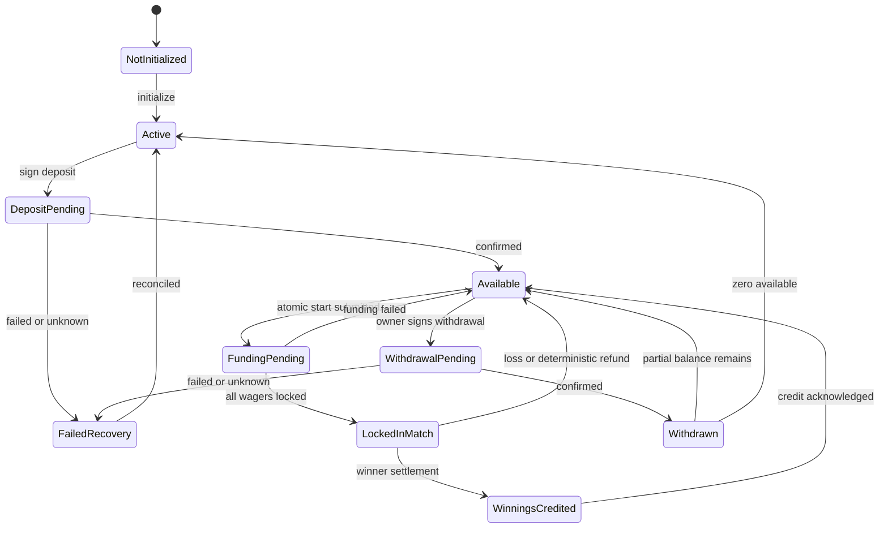
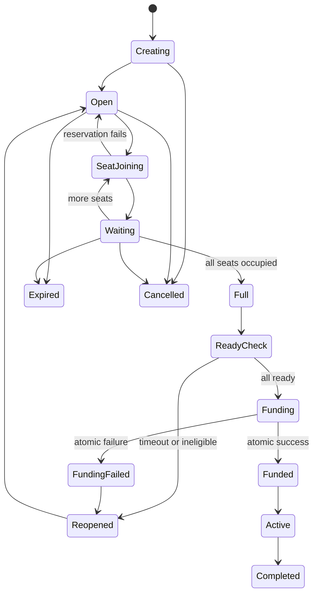
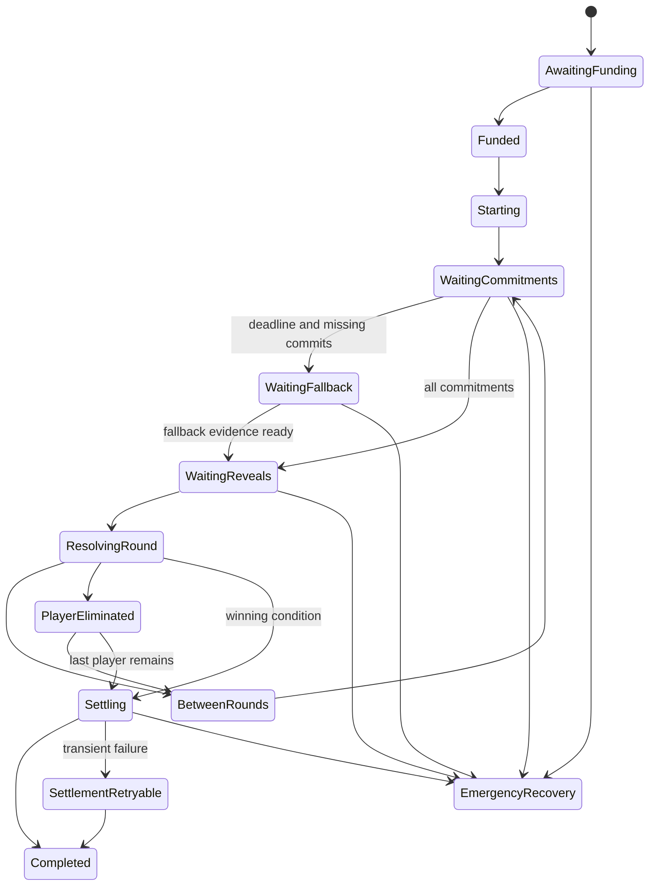

# State Machines

These tables are the normative Prompt 1 lifecycle specification. Solana account
state is authoritative for funds and funded matches. Browser and backend states
are projections and must reconcile before declaring a financial action complete.
Timeouts use the Solana Clock sysvar; UI clocks are estimates.

## Global invariants

- An incomplete lobby never debits, reserves, or locks a player's RPS balance.
- A match starts only after every participant has given match-specific ready
  consent and one program instruction can lock every wager atomically.
- Funding failure leaves every participant's balance unchanged.
- Program instructions use checked integer arithmetic and validate signer,
  ownership, PDA derivation, account relationships, rules version, and state.
- Active-match funds cannot be withdrawn or cancelled.
- Settlement, balance credit, and withdrawal are each idempotent.
- Pausing new games cannot block safe progress, timeout handling, settlement,
  credits, or valid withdrawals.

## Player balance

Balance status and transaction status are orthogonal on-chain fields. The table
uses the required product-facing states to describe their combined projection.

| State                           | Allowed actions                                                                | Required signer / authority                                                                      | Timeout                               | Funds affected                                              | Exit transitions                                                            | Recovery path                                                                    | User-facing message                                                                                |
| ------------------------------- | ------------------------------------------------------------------------------ | ------------------------------------------------------------------------------------------------ | ------------------------------------- | ----------------------------------------------------------- | --------------------------------------------------------------------------- | -------------------------------------------------------------------------------- | -------------------------------------------------------------------------------------------------- |
| **Not initialized**             | Initialize balance PDA; inspect network and program                            | Owner wallet                                                                                     | None                                  | None until initialization transaction lands                 | Active; Failed transaction recovery                                         | Reconcile signature; retry only after expiry/failure                             | **Balance Not Set Up** — Create your on-chain RPS balance before depositing or playing with SOL.   |
| **Active**                      | Deposit; inspect accounting/history; close only if all liabilities are zero    | Owner for value actions; anyone may read                                                         | None                                  | Existing accounting unchanged                               | Deposit pending; Available; Failed transaction recovery                     | Read finalized PDA and vault accounting                                          | Your RPS balance is active.                                                                        |
| **Deposit pending**             | Reconcile submitted signature; rebroadcast identical transaction               | Owner signed the deposit; RPC only transports                                                    | Blockhash expiry; confirmation SLO    | No credit until the program transfer executes               | Available; Failed transaction recovery                                      | Query multiple RPCs; never create a replacement while the first may land         | **Deposit Processing** — Waiting for on-chain confirmation. Do not submit the same deposit again.  |
| **Available**                   | Deposit; withdraw partial/all; join/leave waiting lobbies; issue ready consent | Owner or narrowly scoped session for ready only                                                  | None                                  | Available amount is withdrawable and not locked             | Match funding pending; Withdrawal pending; Deposit pending                  | Finalized on-chain refresh overrides projections                                 | Available RPS balance: {amount} SOL.                                                               |
| **Match funding pending**       | Observe the single atomic start transaction; no duplicate start                | Coordinator fee payer invokes program; every seat must have valid match-specific ready consent   | Ready-consent/funding deadline        | No canonical debit unless the entire instruction succeeds   | Locked in match; Available; Failed transaction recovery                     | Reconcile transaction and all player PDAs; failed instruction changes no balance | **Funding Match** — All wagers must lock together or nobody is charged.                            |
| **Locked in match**             | Play; use authorized fallback/progression; inspect match                       | Scoped gameplay session or owner for own actions; permissionless crank for deterministic actions | Match rule deadlines                  | Exact wager moved from available to locked; cannot withdraw | Winnings credited; Available after loss/refund; Failed transaction recovery | Match continues after disconnect; permissionless settlement/refund retry         | **Lobby Locked** — All wagers are locked and the match has started.                                |
| **Winnings credited**           | Acknowledge credit; inspect match record; withdraw later                       | Program settlement only creates credit; owner acknowledges in UI                                 | None                                  | Net payout credited exactly once to available balance       | Available; Withdrawal pending                                               | Reconcile settlement receipt and player balance PDA                              | **Winnings Credited** — {amount} SOL is now available in your RPS balance.                         |
| **Withdrawal pending**          | Reconcile; rebroadcast identical transaction                                   | Owner wallet only; destination must equal owner wallet in v1                                     | Blockhash expiry; confirmation SLO    | Requested available amount only; locked amount excluded     | Withdrawn; Failed transaction recovery                                      | Verify signature and on-chain nonce before rebuilding                            | **Withdrawal Processing** — Your balance changes only after successful on-chain execution.         |
| **Withdrawn**                   | View receipt; continue with any remaining balance                              | Program after owner-authorized withdrawal                                                        | Terminal for that withdrawal nonce    | Available reduced once; SOL sent only to owner wallet       | Available if partial; Active if zero                                        | Indexer may replay the receipt but cannot reapply value                          | **Withdrawal Confirmed** — {amount} SOL was sent to {wallet}.                                      |
| **Failed transaction recovery** | Reconcile signature/account version; retry only when safe                      | Owner for a replacement value transaction; anyone may read                                       | Operational SLO, not a value deadline | Canonical funds remain at last successful state             | Active; Available; Locked in match; Withdrawal pending                      | Compare finalized account state, receipt nonce, and signature across providers   | **Transaction Needs Review** — No new action will be submitted until on-chain state is reconciled. |

## Lobby

Lobby seats and presence are off-chain coordination until ready consent and
atomic funding. Public creators cannot reject or kick valid joiners. Private
invite possession grants discovery only, never fund authority.

| State              | Allowed actions                                                          | Required signer / authority                                               | Timeout                                | Funds affected                                   | Exit transitions                                 | Recovery path                                                                          | User-facing message                                                                                      |
| ------------------ | ------------------------------------------------------------------------ | ------------------------------------------------------------------------- | -------------------------------------- | ------------------------------------------------ | ------------------------------------------------ | -------------------------------------------------------------------------------------- | -------------------------------------------------------------------------------------------------------- |
| **Creating**       | Set visibility, mode, wager, rules, spectator option; publish or discard | Authenticated creator wallet                                              | Draft TTL                              | None                                             | Open; Cancelled                                  | Discard safely; invite code exists only after publish                                  | Review the lobby rules before publishing. No wager is locked.                                            |
| **Open**           | Join an available seat; creator may cancel only while policy permits     | Authenticated wallet; secure invite for private discovery                 | Lobby expiry                           | None                                             | Seat joining; Waiting; Full; Expired; Cancelled  | Expire stale seats and rate-limit blockers                                             | **Lobby Not Started** — Your wager has not been locked. You may leave without a fee.                     |
| **Seat joining**   | Acquire a short seat lease and verify unique wallet/eligibility          | Joining wallet authentication; backend coordinates lease                  | Short reservation TTL                  | None                                             | Waiting; Full; Open                              | Concurrent claims use compare-and-set; loser sees current lobby                        | Joining seat… No balance has been charged.                                                               |
| **Waiting**        | Leave freely; choose available team/seat; renew presence                 | Each occupant controls own seat/team                                      | Presence lease and lobby expiry        | None                                             | Seat joining; Full; Reopened; Expired; Cancelled | Disconnected seat expires; lobby remains open                                          | Waiting for players. No wagers are locked.                                                               |
| **Full**           | Display final roster; freeze rule edits; begin ready check               | Lobby coordinator after all unique seats are occupied                     | Immediate                              | None                                             | Ready check; Reopened                            | Revalidate leases and eligibility                                                      | The roster is full. Review teams, wager, fee, and payout.                                                |
| **Ready check**    | Each player clicks Ready; revoke before funding starts                   | Owner or scoped session signs match-specific consent                      | Default 30 seconds, snapshotted policy | None                                             | Funding; Reopened                                | Remove missing/ineligible player and reopen seat                                       | Ready check started. Your wager is not locked until atomic funding succeeds.                             |
| **Funding**        | Submit one `fund_match` instruction using all ready consents             | Coordinator/relayer pays fee; program validates every consent and balance | Consent/funding deadline               | All wagers lock together or none do              | Funded; Funding failed                           | Reconcile one transaction; never retry while status is unknown                         | Funding all players. This operation is all-or-nothing.                                                   |
| **Funding failed** | Show failing eligibility category; clear consumed/expired consents       | Program result is authoritative                                           | Immediate                              | None; atomic failure preserves all balances      | Reopened; Expired                                | Re-read balances/sessions; remove only failing/ineligible seats under published policy | **Player Removed** — A player could not complete funding. Nobody was charged and the lobby has reopened. |
| **Reopened**       | Return valid players to waiting; open failed/expired seats               | Coordinator follows deterministic policy; players retain own seats        | Short transition                       | None                                             | Open; Waiting; Full; Expired; Cancelled          | Refresh roster and explain reason                                                      | The lobby reopened because readiness or eligibility changed. No wager was locked.                        |
| **Funded**         | Verify match PDA, immutable snapshot, funded bitmap, and pot             | Program only after atomic validation                                      | Immediate                              | Every wager moves available → locked             | Active                                           | Permissionless activation retry; no creator cancellation                               | **Lobby Locked** — All wagers are locked. Players cannot leave or change teams.                          |
| **Active**         | Navigate players/spectators to match; no seat/rule/team changes          | Program match state                                                       | Match deadlines                        | Entire pot locked                                | Completed                                        | Browser closure does not stop fallback, progression, or settlement                     | Match active. Closing the browser does not cancel the game.                                              |
| **Completed**      | View result, verification, and credited balances                         | Program settlement; anyone may read                                       | Terminal                               | Pot distributed as fee plus credits exactly once | Terminal/archive                                 | Indexer rebuilds from finalized chain records                                          | Match completed. Verify the result and credited balance on-chain.                                        |
| **Expired**        | Release leases; invalidate private code; archive                         | Permissionless/system expiry after deadline                               | Triggered by lobby expiry              | None for incomplete lobby                        | Terminal/archive                                 | Recreate a new lobby; old invite is invalid                                            | Lobby expired. No funds were locked.                                                                     |
| **Cancelled**      | Archive and invalidate invite                                            | Creator only before prohibited point, or deterministic system policy      | Terminal                               | None for incomplete lobby                        | Terminal/archive                                 | Existing funded matches cannot enter this state                                        | Lobby cancelled. No funds were locked or charged.                                                        |

## Match

Every funded match stores mode, rule version, timer, lives, teams, wager, fee,
payout formula, fallback method, and spectator setting. The same lifecycle
supports 1v1, 2v2, and 1v1v1v1.

| State                            | Allowed actions                                                                | Required signer / authority                                               | Timeout                                  | Funds affected                                               | Exit transitions                                                      | Recovery path                                                            | User-facing message                                                                 |
| -------------------------------- | ------------------------------------------------------------------------------ | ------------------------------------------------------------------------- | ---------------------------------------- | ------------------------------------------------------------ | --------------------------------------------------------------------- | ------------------------------------------------------------------------ | ----------------------------------------------------------------------------------- |
| **Awaiting funding**             | Validate match snapshot and ready consents; atomically fund                    | Coordinator fee payer; program verifies all player consents               | Funding deadline                         | None until full success                                      | Funded; lobby Funding failed; Emergency recovery                      | Atomic failure returns to lobby with no debit                            | Waiting for all wagers to fund together.                                            |
| **Funded**                       | Verify funded bitmap, pot, fee, and rules hash                                 | Program                                                                   | Immediate                                | Full pot locked                                              | Starting; Emergency recovery                                          | Permissionless start retry                                               | All wagers are funded under immutable rules.                                        |
| **Starting**                     | Fix seats/teams/deadlines; open first round                                    | Program; any fee payer may crank                                          | Short start deadline                     | Pot remains locked                                           | Waiting for commitments; Emergency recovery                           | Retry deterministic transition                                           | Match starting. Teams and seats are locked.                                         |
| **Waiting for commitments**      | Submit one commitment per active seat                                          | Seat owner or scoped gameplay session                                     | Stored move timer, initially 20 seconds  | Pot unchanged and locked                                     | Waiting for timeout fallback; Waiting for reveals; Emergency recovery | Duplicate identical commit is idempotent; refresh after disconnect       | Choose and lock your move. Moves remain hidden.                                     |
| **Waiting for timeout fallback** | Request/consume the snapshotted verifiable fallback mechanism                  | Permissionless crank; randomness provider proof verified by program       | Provider-specific timeout/retry in rules | Pot unchanged                                                | Waiting for reveals; Resolving round; Emergency recovery              | Retry alternate permitted provider request only if rules committed to it | Time expired. Preparing the published automatic-move fallback.                      |
| **Waiting for reveals**          | Reveal committed moves through the approved forced/timed mechanism             | Seat session/owner or validated threshold/timed reveal proof              | Stored reveal deadline                   | Pot unchanged                                                | Resolving round; Waiting for timeout fallback; Emergency recovery     | Real-SOL remains disabled until selective non-reveal is safely resolved  | Commitments are locked. Waiting for protocol-authorized reveals.                    |
| **Resolving round**              | Verify reveals/fallbacks; calculate mode-specific result once                  | Program; any fee payer may invoke deterministic resolution                | Immediate/retryable                      | Pot unchanged                                                | Between rounds; Player eliminated; Settling; Emergency recovery       | Recompute from canonical evidence; duplicate resolution rejected         | Resolving round {round} from on-chain evidence.                                     |
| **Between rounds**               | Show result/history; initialize next immutable round                           | Program; anyone may crank                                                 | Short presentation delay is UI-only      | Pot unchanged                                                | Waiting for commitments; Settling; Emergency recovery                 | Skip animation after reconnect; chain phase controls actions             | Round complete. The next round begins automatically.                                |
| **Player eliminated**            | Mark zero-life player; keep them as spectator                                  | Program only from valid 1v1v1v1 result                                    | Immediate                                | Pot unchanged; no early payout                               | Between rounds; Settling; Emergency recovery                          | Eliminated player reconnects as spectator                                | You have been eliminated and may continue watching.                                 |
| **Settling**                     | Compute winner, floor-rounded fee, deterministic credits; settle once          | Program; anyone may submit/crank                                          | Operational SLO; no claim deadline       | Locked balances become exact winner credits and treasury fee | Completed; Settlement retryable; Emergency recovery                   | Idempotent settlement receipt and retry                                  | Match complete. Crediting winnings to the RPS balance.                              |
| **Completed**                    | Acknowledge winnings; verify record; withdraw available balance later          | Anyone may read; owner signs later withdrawal                             | Terminal                                 | Locked amount zero; credits/fee equal pot                    | Terminal                                                              | Rebuild display from match and settlement receipts                       | Match completed and settlement verified.                                            |
| **Settlement retryable**         | Resubmit identical deterministic settlement                                    | Any fee payer; program validates receipt/state                            | Retry with bounded backoff               | Pot remains locked until atomic credit succeeds              | Completed; Emergency recovery                                         | RPC failover and permissionless retry; no alternate winner/destination   | Settlement is delayed but retryable. Funds remain locked on-chain.                  |
| **Emergency recovery**           | Continue safe deterministic actions, or apply precommitted delayed refund path | Program-constrained multisig may pause; users/anyone invoke allowed exits | Rules/configured recovery delay          | Funds remain attributed; no admin redirection                | Prior state; Settling; Completed                                      | Prefer normal completion; otherwise deterministic owner-bound refund     | Recovery mode is active. Published on-chain rules determine every fund destination. |

## Transaction status projection

All value-changing user interfaces use these states:

| Status                   | Completion meaning                                                                       |
| ------------------------ | ---------------------------------------------------------------------------------------- |
| Awaiting wallet approval | No transaction exists and nothing changed.                                               |
| Submitted                | Signature exists; success is not established.                                            |
| Processing               | RPC observed the transaction below required confirmation.                                |
| Confirmed                | Required confirmation reached; critical state is re-read.                                |
| Finalized where required | Finality reached for history/audit policy.                                               |
| Failed                   | Chain reported a definitive error; no partial program mutation occurred.                 |
| Rejected                 | Wallet declined; nothing was submitted.                                                  |
| Expired                  | Blockhash expired and reconciliation found no landing.                                   |
| Retrying                 | Same idempotent action/signature is being transported or rebuilt only after safe expiry. |
| Reconciled               | Signature, account version, receipts, and index projection agree.                        |

## Recovery rules

1. Unknown is not failed. Never replace a value transaction until the original
   signature and expected account version are reconciled.
2. WebSocket events trigger refreshes; they are never the sole authority.
3. Backend/indexer downtime cannot prevent direct owner withdrawal or
   permissionless timeout/settlement where the program permits it.
4. Emergency authority cannot choose winners, alter moves/scores/fees, redirect
   balances, or close an account with unresolved liabilities.
5. The selective non-reveal production gate in
   [Fairness, Sessions, and Randomness](09-fairness-sessions-randomness.md)
   remains binding.
