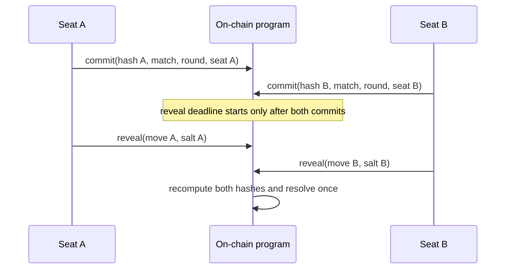
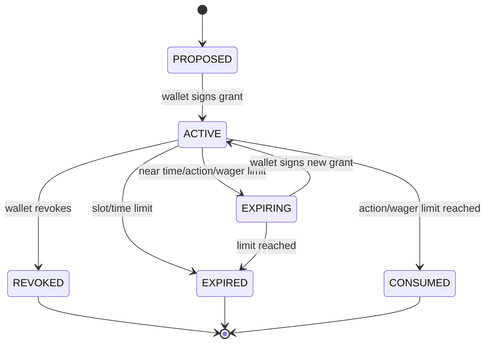

# Fairness, Sessions, and Randomness

## Safety gate

Commit/reveal hides simultaneous choices only until one player reveals. It does
not force the other player to reveal. A player who sees a losing opponent reveal
can selectively withhold and accept whichever timeout consequence is cheaper.
**VRF alone does not solve selective non-reveal**: public randomness can
randomize an outcome or timing, but it neither recovers a withheld move nor
proves what that move was.

Therefore **real-SOL wagering is blocked pending a validated timed-reveal,
threshold-reveal, or equivalent protocol that removes profitable selective
non-reveal**. “Validated” means a written protocol, cryptographic review,
adversarial tests, liveness/failure analysis, and an on-chain-verifiable
recovery path. Until that gate passes, use devnet, play money, or non-custodial
demonstrations with no prize of monetary value. No design here should be
described as risk-free.

## Deterministic commitment

Both Rust and TypeScript must hash exactly the same fixed-width byte sequence.
Do not hash JSON, text-form public keys, variable-width integers, Borsh structs
that may evolve, or concatenated user strings.

This section is the normative commitment encoding. Any shorter commitment
pseudocode elsewhere in the design is illustrative and must be updated or
rejected at implementation review; omitting cluster, rules hash, or seat would
weaken the required replay domain.

### Canonical binary format, version 1

```text
commitment_v1 =
    SHA-256(
        domain_separator       [14 bytes]
      || program_id             [32 bytes]
      || cluster_id             [32 bytes]
      || match_id               [32 bytes]
      || rules_hash             [32 bytes]
      || round_le                [2 bytes]
      || player_wallet          [32 bytes]
      || seat                    [1 byte]
      || move                    [1 byte]
      || salt                   [32 bytes]
    )
```

Total preimage length: **210 bytes**.

| Field              | Exact encoding and validation                                                                                                                   |
| ------------------ | ----------------------------------------------------------------------------------------------------------------------------------------------- |
| `domain_separator` | ASCII bytes for `RPS_COMMIT_V1` followed by one `0x00`: `52 50 53 5f 43 4f 4d 4d 49 54 5f 56 31 00`                                             |
| `program_id`       | Raw 32-byte Solana program public key expected by the client; reject any other program                                                          |
| `cluster_id`       | Raw 32-byte genesis hash (or another immutable 32-byte cluster identifier fixed by the rules schema); reject a configured cluster mismatch      |
| `match_id`         | Raw 32-byte match PDA, not a display identifier                                                                                                 |
| `rules_hash`       | Raw 32-byte SHA-256 digest of the canonical, immutable rules manifest                                                                           |
| `round_le`         | Unsigned `u16`, exactly two bytes, little-endian; rounds start at `1`; `0` is invalid                                                           |
| `player_wallet`    | Raw 32-byte public key bound to this seat                                                                                                       |
| `seat`             | `0x00..0x03` for seats `0..3`; require the seat to exist in the immutable mode (`0..1` for 1v1, `0..3` for 2v2/free-for-all)                    |
| `move`             | `0x00` rock, `0x01` paper, `0x02` scissors; reject all other values                                                                             |
| `salt`             | Exactly 32 bytes from a cryptographically secure random generator; never a password, timestamp, UUID, counter, wallet signature, or shared salt |

The rules manifest also has an independently versioned canonical encoding and
commits at minimum to wager/amount, fee amount/recipient, scoring target, lives,
team pairing, tie/sudden-death behavior, commit/reveal durations, automatic
fallback behavior, settlement policy, emergency behavior, and fairness mechanism
version. Canonical test vectors are release-blocking.

### Shared Rust implementation

```rust
use sha2::{Digest, Sha256};
use solana_program::pubkey::Pubkey;

pub const COMMIT_DOMAIN_V1: &[u8; 14] = b"RPS_COMMIT_V1\0";

pub fn commitment_v1(
    program_id: &Pubkey,
    cluster_id: &[u8; 32],
    match_id: &Pubkey,
    rules_hash: &[u8; 32],
    round: u16,
    player_wallet: &Pubkey,
    seat: u8,
    move_code: u8,
    salt: &[u8; 32],
) -> Result<[u8; 32], &'static str> {
    if round == 0 { return Err("invalid round"); }
    if seat > 3 { return Err("invalid seat"); }
    if move_code > 2 { return Err("invalid move"); }

    let mut preimage = [0u8; 210];
    let round_bytes = round.to_le_bytes();
    let seat_bytes = [seat];
    let move_bytes = [move_code];
    let mut i = 0;
    for part in [
        &COMMIT_DOMAIN_V1[..],
        program_id.as_ref(),
        &cluster_id[..],
        match_id.as_ref(),
        &rules_hash[..],
        &round_bytes,
        player_wallet.as_ref(),
        &seat_bytes,
        &move_bytes,
        &salt[..],
    ] {
        preimage[i..i + part.len()].copy_from_slice(part);
        i += part.len();
    }
    Ok(Sha256::digest(preimage).into())
}
```

The mode-specific caller must additionally reject a seat that is not part of the
match. The byte layout is normative.

### Shared TypeScript implementation

```typescript
import { PublicKey } from "@solana/web3.js";
import { sha256 } from "@noble/hashes/sha256";

const DOMAIN_V1 = new TextEncoder().encode("RPS_COMMIT_V1\0");

export function commitmentV1(input: {
  programId: PublicKey;
  clusterId: Uint8Array;
  matchId: PublicKey;
  rulesHash: Uint8Array;
  round: number;
  playerWallet: PublicKey;
  seat: 0 | 1 | 2 | 3;
  move: 0 | 1 | 2;
  salt: Uint8Array;
}): Uint8Array {
  if (DOMAIN_V1.length !== 14) throw new Error("bad domain");
  if (input.clusterId.length !== 32) throw new Error("bad cluster id");
  if (input.rulesHash.length !== 32) throw new Error("bad rules hash");
  if (input.salt.length !== 32) throw new Error("bad salt");
  if (
    !Number.isSafeInteger(input.round) ||
    input.round < 1 ||
    input.round > 0xffff
  ) {
    throw new Error("bad round");
  }
  const round = new Uint8Array(2);
  new DataView(round.buffer).setUint16(0, input.round, true);
  const preimage = new Uint8Array(210);
  let offset = 0;
  for (const part of [
    DOMAIN_V1,
    input.programId.toBytes(),
    input.clusterId,
    input.matchId.toBytes(),
    input.rulesHash,
    round,
    input.playerWallet.toBytes(),
    Uint8Array.of(input.seat),
    Uint8Array.of(input.move),
    input.salt,
  ]) {
    preimage.set(part, offset);
    offset += part.length;
  }
  if (offset !== 210) throw new Error("bad preimage length");
  return sha256(preimage);
}
```

Required shared fixtures include boundary rounds `1` and `0xffff`, all four seat
bytes (with mode-specific invalid-seat tests), all moves, leading-zero
salts/keys, distinct cluster IDs, and at least one independently calculated
expected preimage hex and digest. Rust, TypeScript, and on-chain verification
must consume the same fixture file in CI.

## Commit/reveal phases and replay protection



Phase rules:

1. The match stores immutable `program_id`, match PDA, rules hash, seat wallets,
   current round, phase, absolute deadlines, and one commitment/reveal bit per
   seat.
2. A commitment is accepted only in `COMMIT_OPEN`, for the current
   match/round/seat, from the bound wallet or valid scoped session, while
   `clock < commit_deadline`.
3. The first valid commitment cannot be changed or cleared. An identical retry
   is idempotent; a conflicting retry fails.
4. Reveal does not open until both commitments are stored. This prevents the
   second player from choosing after seeing the first move.
5. A reveal is accepted only in `REVEAL_OPEN`, while `clock < reveal_deadline`,
   from its bound authority, and only when recomputation exactly equals the
   stored commitment. Timeout is eligible when `clock >= deadline`; the same
   boundary is used in every implementation.
6. The first valid reveal is immutable. Invalid preimages reveal nothing
   on-chain beyond their submitted transaction data and do not consume the valid
   reveal slot; clients must avoid submitting guesses.
7. The round resolves exactly once. The program increments a checked round
   counter and clears round-specific storage only as part of entering the next
   round.
8. Domain, program ID, cluster ID, match PDA, rules hash, round, wallet, and
   seat prevent replay across applications, deployments, clusters, matches, rule
   sets, rounds, wallets, and seats. Program state prevents replay within the
   same tuple.
9. Transaction-level anti-replay (recent blockhash or durable nonce) is
   additional transport protection, not a substitute for application replay
   checks.
10. Deadlines come from the Clock sysvar. The backend cannot grant hidden
    extensions or accept an off-chain reveal as final.

Salt handling:

- Generate salts in the browser with
  `crypto.getRandomValues(new Uint8Array(32))` or in a trusted native signer.
  Never request salt from the backend.
- Store `{program, match, rules, round, wallet, seat, move, salt, commitment}`
  encrypted at rest locally until finalized reveal. Do not log, synchronize to
  analytics, place in URL/query state, or send before reveal.
- Offer an encrypted export before commitment and an explicit deletion after
  finalized settlement. Losing local state before reveal is a forfeit risk.
- A backend copy improves availability only by adding trust and leakage risk; it
  is not the default recovery mechanism.

## Scoped ephemeral session authorization

A session key improves repeated-action UX but is not a wallet and must not
become a general-purpose delegate.



### Grant contents

The wallet signs a domain-separated authorization containing:

- chain/genesis hash, program ID, wallet, session public key, and unique 32-byte
  grant ID;
- allowed instruction discriminators only: normally `join`, `ready`, `commit`,
  `reveal`, and retry of deterministic settlement;
- optional exact lobby/match IDs and seat; wildcard match grants are disabled
  for real-value mode;
- maximum wager per match, maximum cumulative authorized wager, maximum protocol
  fee, and maximum number of matches/actions;
- `not_before_slot`, absolute `expires_at_slot`, and a human-readable duration;
- whether fee sponsorship is allowed and the maximum sponsored lamports; and
- explicit denials for arbitrary transfer, change of withdrawal destination,
  withdrawal, grant creation, admin action, and delegation to another key.

Recommended maximum duration is one match plus a short recovery window, capped
at 24 hours for non-value testing. Real-value limits remain disabled until the
fairness safety gate passes. The wallet approval screen must show the exact
maximum wager, cumulative exposure, duration, actions, fee policy, program, and
revocation method.

### Lifecycle, revocation, and recovery

1. Generate the session key locally with a cryptographically secure provider.
   Prefer non-exportable WebCrypto/OS-backed storage; never place the private
   key in localStorage, cookies, logs, URLs, analytics, backend responses, or
   source maps.
2. The wallet signs the grant. The program records the grant ID/nonce and
   constraints in a PDA or verifies an equivalent wallet-signed capability with
   an on-chain revocation/consumption record.
3. Every session action verifies signature, grant owner, program, match/seat
   scope, instruction scope, slot bounds, wager/fee/action counters, revocation
   epoch, and monotonic nonce. Verification and counter consumption are atomic.
4. The wallet can revoke at any time through a direct wallet-signed instruction
   that requires no session key and no backend. “Revoke all” increments the
   wallet revocation epoch.
5. Expiration, consumption, match settlement, wallet change, or explicit
   revocation makes the key unusable. The UI deletes local key material and salt
   records no longer needed.
6. If the device/session key is lost, the wallet reconnects, revokes the grant,
   and either completes actions directly or creates a new narrower grant. A
   replacement key never inherits authority automatically.
7. If the wallet is unavailable, there is no account-recovery bypass that lets
   support/admin impersonate it. Timeout and deterministic settlement preserve
   liveness.

Fee sponsorship is transport only. A relayer may be transaction fee payer,
simulate, submit, and retry, but cannot alter instructions, match IDs, amounts,
deadlines, or destinations. The signed message binds the full action and a
recent nonce; the program accepts it at most once. Rate-limit sponsorship by
wallet, session, IP/risk signal, and global budget without making sponsored
service necessary for exit or settlement.

## Fairness and privacy option comparison

| Option                                     | What it provides                                                                           | What it does not provide / key risks                                                                                                   | Fit and gate                                                                                           |
| ------------------------------------------ | ------------------------------------------------------------------------------------------ | -------------------------------------------------------------------------------------------------------------------------------------- | ------------------------------------------------------------------------------------------------------ |
| Plain commit/reveal                        | Simple on-chain verification; moves hidden until reveal; no oracle dependency              | Selective non-reveal, lost salts, public revealed moves, deadline liveness                                                             | Devnet/play-money only unless non-reveal has no exploitable value                                      |
| Switchboard VRF                            | Verifiable public randomness with an established oracle workflow                           | Does not recover a withheld move or by itself stop selective non-reveal; oracle cost, latency, callback/liveness and integration trust | Useful for matchmaking, tie-break rules, or random penalties; not sufficient to unlock real-SOL        |
| ORAO VRF                                   | Solana-oriented verifiable randomness and request/fulfillment model                        | Same selective non-reveal limitation; oracle availability, fee, account and callback assumptions                                       | Candidate randomness provider after dependency and liveness review; not sufficient alone               |
| VRF-selected timeout outcome               | Makes timeout winner/penalty less predictable                                              | A player can still compare reveal/non-reveal expected values; can punish an honest player during outages; does not prove hidden move   | Only if game-theoretic analysis proves withholding never improves expected utility; still needs review |
| Scoped session key                         | Low-friction commits/reveals and sponsored fees; bounded automation                        | Key theft within scope, device loss, no secrecy if storage leaks; not a randomness or forced-reveal mechanism                          | Recommended UX layer with strict limits; independent of fairness gate                                  |
| Preauthorized move set / transaction       | Wallet approves a bounded future action or encrypted payload before seeing opponent reveal | Relayer censorship; plaintext preauthorization leaks move; cancellation semantics may recreate selective abort; transaction expiry     | Potential component only when program can enforce one-time execution without trusted relayer           |
| Encrypted move with single decryptor       | Move can be posted before reveal and later decrypted                                       | Single decryptor can leak, censor, collude, or go offline; key rotation/recovery risk                                                  | Not acceptable for real-SOL without removing single-party trust                                        |
| Threshold encryption / threshold reveal    | Ciphertext is committed before deadline; quorum can reveal even if player disappears       | Committee collusion, DKG/key rotation complexity, quorum liveness, cost, timing and slashing assumptions                               | Primary candidate for real-SOL after cryptographic and operational validation                          |
| Timed encryption / time-lock puzzle        | Intended automatic disclosure after elapsed work/time                                      | Hardware/time variance, early solving, delayed solving, verification cost, parameter fragility                                         | Research candidate; requires benchmarked, audited, on-chain-verifiable construction                    |
| Trusted execution environment              | Can hold/decrypt moves and attest execution                                                | Hardware/vendor trust, side channels, rollback, availability, attestation verification and centralization                              | Equivalent only if trust is explicitly accepted and failure does not trap funds                        |
| ZK proof of valid encrypted move           | Proves ciphertext encodes a legal move without revealing it                                | Proof alone does not ensure future decryption; circuits/setup/prover complexity                                                        | Strong companion to threshold/timed reveal, not a standalone liveness solution                         |
| Confidential-compute/privacy chain feature | May hide moves and reveal according to a protocol                                          | New bridge/runtime/validator assumptions, composability and audit surface                                                              | Evaluate as a separate architecture; do not market as trustless without evidence                       |

Provider names are candidates, not endorsements. Pin versions and program IDs,
verify current audits and deployment status, model provider outage and upgrade
authority, and test on the intended cluster before adoption.

## Spectator privacy

During an active round, public views show only:

- match ID and immutable rules summary/hash;
- pseudonymous/truncated seat addresses unless a player opts into a profile;
- phase and deadlines;
- whether each seat has committed/revealed, never the move, salt, encrypted
  plaintext, session key, IP/device data, or mempool hints; and
- escrow amount/fee as required for verification.

Do not send unrevealed moves or salts to chat, presence, analytics, crash
reporting, support tooling, server logs, push notifications, URL state, or
spectator WebSockets. WebSocket topics are match-scoped and expose only public
on-chain facts. Rate-limit address enumeration and profile lookups, while
recognizing that on-chain accounts remain publicly discoverable. Prevent
spectators from using hidden preloads, accessibility labels, source state,
timing-specific assets, or client bundles to infer a move. Delay optional player
reactions/chat until both reveals finalize.

After settlement, the verification view may disclose moves and salts because
public on-chain reveals already do. The product must state this before
commitment. If the selected future encryption scheme supports permanent move
privacy with public proof, publish only the proof and outcome.

## Independent verification view

For each match, provide a read-only “Verify” view and downloadable JSON receipt
containing:

1. cluster/genesis hash, program ID/version, match PDA, transaction signatures,
   and finalized slot;
2. raw immutable rules manifest, canonical bytes, and computed `rules_hash`;
3. seat wallet keys, seat numbers, wager, fee, deadlines, and escrow account;
4. for each round, commitment digest, reveal move/salt after public reveal,
   canonical 210-byte preimage hex, recomputed digest, deadline slots, and
   timeout evidence;
5. outcome calculation (`rock < paper < scissors < rock`), score progression,
   terminal reason, and replay counters;
6. starting escrow, exact player entitlements, exact fee, transfer/credit
   records, and ending escrow of zero; and
7. fairness mechanism details: oracle/committee/timed-reveal identifiers,
   requests, responses, proofs, signer/quorum set, and verification result where
   applicable.

The view reads canonical RPC data and labels indexer-derived convenience data.
It offers “copy verification command/code” that runs locally, and it
distinguishes `processed`, `confirmed`, and `finalized`. Verification failure
uses:
`Verification failed for {field}. Do not rely on this result or deposit funds.`
A pending record uses: `Verification is waiting for finalized on-chain data.` A
successful record uses:
`Verified against finalized on-chain data. This confirms the recorded rules and settlement, not that the protocol is risk-free.`

## Release criteria

- Shared cross-language commitment fixtures pass byte-for-byte.
- Fuzz/property tests reject wrong domain, program, match, rules, round, wallet,
  seat, move, salt, phase, deadline, and replay.
- Session tests cover theft within scope, over-limit wager/fee/action, expiry
  boundary, nonce races, revoke-one, revoke-all, lost key, backend outage, and
  fee-payer substitution.
- Spectator and telemetry tests prove no move/salt/session secret leaks before
  permitted disclosure.
- Timeout economics are modeled for every information set and network-failure
  case.
- A qualified review validates the timed/threshold reveal or equivalent
  mechanism and its operational liveness.
- Mainnet/real-SOL feature flags remain impossible to enable through frontend
  configuration alone and remain blocked until all criteria are recorded as
  passed.
