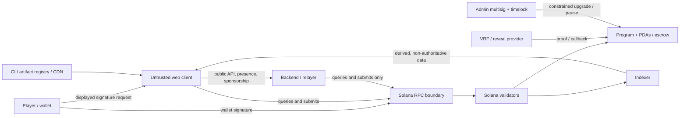

# Security Threat Model

## Scope and safety statement

This model covers the Solana program and accounts, wallet and scoped session
authorization, web client, API/backend/relayer, admin operations, RPC providers,
indexer, randomness or reveal providers, telemetry, and the interfaces between
them. It covers deposits, public/private lobby coordination, atomic funding,
commit/reveal, timeout, settlement, withdrawal, and emergency recovery.
Automatic PvP matchmaking is outside scope.

The system must never be described as risk-free, trust-free, guaranteed, or safe
solely because it uses a blockchain or audited dependency. Controls reduce risk;
they do not eliminate smart-contract defects, key compromise, dependency
failure, chain instability, economic attacks, or user error. Real-SOL play
remains blocked until the fairness gate in `09-fairness-sessions-randomness.md`
is satisfied.

Security goals:

- only an authorized player can create exposure or act for that player's seat;
- funds are conserved, correctly attributed, and withdrawable/settleable without
  backend cooperation;
- rules, commitments, reveals, deadlines, outcomes, fees, and emergency behavior
  cannot be changed after consent;
- hidden moves, salts, session keys, and sensitive off-chain metadata are not
  disclosed before policy permits;
- replay, duplicate settlement, selective non-reveal, impersonation, and
  cross-match confusion fail safely;
- chain-derived views remain available and honest despite backend, RPC, or
  indexer failure; and
- privileged changes are minimized, delayed, observable, reversible where
  possible, and unable to redirect player entitlements.

Out of scope as guarantees: safety of the user's device/wallet software, Solana
consensus correctness, undiscovered cryptographic breaks, fiat/market value,
tax/legal treatment, and recovery of a lost wallet seed. These remain
dependencies or user risks and must be communicated plainly.

## Assets

| Asset                                                 | Required property                                                                              |
| ----------------------------------------------------- | ---------------------------------------------------------------------------------------------- |
| Player wallet authority and seed                      | Never handled or stored by the application; signatures are intentional and correctly displayed |
| Session private key and grant                         | Confidential, narrowly scoped, bounded, revocable, non-replayable, and short-lived             |
| Move and salt before reveal                           | Confidential and recoverable by the player; bound to exact match/rules/round/wallet/seat       |
| Deposited balances and match escrow                   | Conserved, available according to state, never admin-custodied, no double debit/payout         |
| Lobby/match/rules state                               | Authentic, immutable after acceptance, correctly sequenced, and replay-resistant               |
| Deadlines and timeout evidence                        | Derived from canonical Clock/state and not backend discretion                                  |
| Settlement entitlement and receipt                    | Deterministic, one-time, complete, and independently verifiable                                |
| Program binaries, IDL, client bundle, deployment keys | Integrity, provenance, controlled release, and observable upgrade policy                       |
| Admin/multisig/relayer/oracle keys                    | Confidential, least-privilege, rotated, monitored, and independently held                      |
| RPC/indexer/API data                                  | Integrity, freshness, availability, provenance, and clear confirmation level                   |
| User identity/profile/contact and network metadata    | Confidentiality, minimization, retention limits, and access logging                            |
| Logs, analytics, traces, support exports              | No secrets; integrity, access control, retention/deletion policy                               |
| Availability and sponsorship budget                   | Protected from abuse without making a centralized service necessary for fund exit              |

## Actors and capabilities

- **Player:** controls a wallet and possibly an ephemeral session key; may be
  honest, mistaken, compromised, or strategically adversarial.
- **Opponent:** sees public chain state and may front-run, delay, censor through
  a colluding service, selectively disconnect, refuse reveal, or create many
  identities.
- **Spectator/bot/searcher:** reads public transactions/accounts, monitors
  propagation, scrapes APIs, sends malformed traffic, and may exploit timing or
  leaked UI state.
- **Wallet/provider/extension:** signs or rejects transactions and can be
  compromised, malicious, or display incomplete information.
- **Frontend publisher/CDN/dependency:** serves executable code; compromise can
  replace destinations, request malicious signatures, or exfiltrate secrets.
- **Backend/API/relayer/matchmaker:** suggests transactions, sponsors fees,
  broadcasts presence, and indexes convenience data; it is not trusted with
  custody or game outcome.
- **RPC provider:** supplies blockhashes, simulation, account and transaction
  data and accepts submissions; it can be stale, inconsistent, censoring, or
  malicious.
- **Indexer/database/cache:** derives searchable views; it can lag, omit,
  duplicate, reorder, or fabricate derived records.
- **Program and Solana validators/runtime:** enforce canonical state, subject to
  program bugs, upgrades, cluster incidents, reorg/fork behavior, and runtime
  assumptions.
- **Fairness provider:** VRF, threshold committee, decryptor, TEE, or
  timed-reveal network; may be unavailable, colluding, biased within its
  protocol, or upgraded.
- **Admin/operator/support/developer/CI:** can deploy/configure, pause, sponsor,
  inspect production systems, or publish frontend code; may err or be
  compromised.
- **External attacker/insider:** seeks keys, code execution, privilege
  escalation, data exfiltration, denial of service, fraud, or extortion.

## Trust boundaries



Boundary rules:

1. Wallet signatures are the authority boundary. Human-readable UI is advisory;
   the signed transaction/message binds exact program, accounts, amounts,
   instruction, limits, and nonce.
2. The web client is untrusted by the program. All values are revalidated
   on-chain.
3. Backend, relayer, RPC, and indexer are replaceable transports/views. None may
   decide entitlement, redirect funds, extend deadlines, or be required for
   timeout/settlement/recovery.
4. On-chain data is authoritative only after the stated confirmation level.
   Indexer data is always labeled derived.
5. Admin authority is a hazardous trust boundary, not a safety oracle. Program
   constraints apply to admins too.
6. Third-party code and fairness providers add their own upgrade, availability,
   key, and supply-chain boundaries.

## STRIDE threat analysis and mitigations

### On-chain program, accounts, and funds

| STRIDE                      | Threat / abuse case                                                                                                                                       | Required mitigations and verification                                                                                                                                                                                                                                     |
| --------------------------- | --------------------------------------------------------------------------------------------------------------------------------------------------------- | ------------------------------------------------------------------------------------------------------------------------------------------------------------------------------------------------------------------------------------------------------------------------- |
| Spoofing                    | Fake wallet/seat/session, substituted program ID, lookalike mint, forged sysvar, wrong PDA/account owner                                                  | Require transaction signer or verified Ed25519 session signature; bind wallet and seat; derive/check every PDA seed and bump; check executable program ID, owners, native-SOL mode or exact mint/token program; use canonical Clock sysvar; show verified program/cluster |
| Spoofing                    | Account substitution or remaining-accounts confusion redirects escrow, fee, refund, or winner                                                             | Use explicit typed account constraints; recompute fixed recipient keys; reject duplicates/aliases and unexpected writable/signers; never accept backend-selected payout destination; test account permutations                                                            |
| Tampering                   | Client/back end changes wager, rules, fee, deadline, seat, move mapping, or emergency policy                                                              | Hash canonical immutable rules; both players authorize exact terms; store/check rules hash in every action; checked enum/range validation; emit immutable term snapshot                                                                                                   |
| Tampering                   | Arbitrary CPI, malicious token hooks, account close/reinitialize, PDA revival, or upgrade changes behavior                                                | Allowlist CPI programs and instructions; native SOL first or tightly constrain token extensions; discriminator/version checks; one-way initialized/closed markers; safe account close only at zero; pin dependencies; constrain upgrade authority                         |
| Repudiation                 | Player denies join/ready/commit/reveal/session grant; admin denies pause/upgrade                                                                          | Domain-separated signatures with nonce, grant ID, slot bounds, and exact scope; on-chain event/account evidence; multisig/timelock records; downloadable verification receipt                                                                                             |
| Information disclosure      | Move/salt appears in commit instruction, logs/events, error text, simulation, memo, or account                                                            | Commitment carries digest only; never log preimage; inspect events and transaction construction; generic custom errors; reveal only in reveal phase; privacy tests over serialized transactions/logs                                                                      |
| Denial of service           | Account locking, compute exhaustion, oversized inputs, rent griefing, spam lobbies, forced expensive settlement                                           | Fixed-size bounded accounts; bounded rounds/player count; compute-budget tests; attributable rent policy; rate limits off-chain; permissionless timeout/settlement; winner credits are internal owner balances so recipient behavior cannot block settlement              |
| Denial of service           | One player never commits/reveals; provider/backend/relayer disappears                                                                                     | Absolute on-chain deadlines; deterministic permissionless exits; direct wallet paths; validated timed/threshold reveal before real value; emergency path that cannot seize funds                                                                                          |
| Elevation of privilege      | Session key withdraws, delegates, changes destination, exceeds wager/fee/duration, or creates grants                                                      | Instruction allowlist; match/seat binding; max per-match and cumulative wager, fee, action and duration counters; atomic nonce/counter consumption; withdrawal disabled by default; wallet-only revoke and grant                                                          |
| Elevation of privilege      | Admin pauses forever, sets winner/fee/destination, drains vault, or upgrades to malicious code                                                            | Multisig with independent holders; timelock and public notice; narrow pause blocks inflow but preserves safe exits; immutable entitlement/fee limits; no admin transfer primitive; delayed user emergency recovery; remove/freeze upgrade authority when mature           |
| Tampering                   | Integer overflow/underflow, rounding/dust, wrong decimals, duplicate payout, partial funding or settlement                                                | Checked arithmetic; lamports as `u64` with wider intermediate where needed; conservation assertions; exact fee policy; atomic dual funding; settled/claimed bit before or with transfer; escrow-zero postcondition; property/fuzz tests                                   |
| Tampering                   | Reentrancy/state inconsistency around CPI or transfer failure                                                                                             | Checks-effects-interactions where applicable; Solana account-lock assumptions documented, no signer seeds exposed beyond exact CPI; atomic instruction; post-CPI account/balance validation; adversarial CPI tests                                                        |
| Tampering                   | Replay across program, cluster, match, rules, round, wallet, seat, session, or transaction                                                                | Commitment binds all fields; session grant binds genesis/program and unique grant ID; monotonic nonces and consumed bits; recent blockhash/durable nonce; reject stale state/version                                                                                      |
| Repudiation/Tampering       | Deadline ambiguity, slot timestamp manipulation assumptions, race between reveal and timeout                                                              | Store absolute slot; use Clock sysvar; define boundary (`clock < deadline` accepted, timeout when `clock >= deadline`); same-state atomic race means one wins and the other safely fails; test boundary slots                                                             |
| Denial of service           | Rent recipient or destination cannot receive/close; zero-lamport account behavior                                                                         | Predetermine compatible system accounts; separate immutable claim credit from push transfer; allow owner pull withdrawal; never make fee recipient availability block player entitlement                                                                                  |
| Elevation of privilege      | Mainnet, real SOL, wrong genesis, unsupported asset, or over-cap fee is enabled by a frontend/server flag                                                 | On-chain/config account and process startup enforce non-mainnet genesis/program/asset allowlists and fee cap; transaction-time rejection is mandatory; frontend flags can only hide, never authorize; real-SOL gate is fail-closed                                        |
| Tampering/Denial of service | 2v2/free-for-all uses wrong seat count/team, teammate reveals for another, timeout eliminates/refunds wrong players, tie counter or round cap is bypassed | Snapshot mode/player/team map; per-seat signer; mode-specific deterministic resolver; checked active bitmap/score/tie/round counters; fixtures for every fault combination, tie safety, unique-leader and remainder rule                                                  |

### Web client, wallet, and browser

| STRIDE                          | Threat / abuse case                                                                                                          | Required mitigations and verification                                                                                                                                                                                                            |
| ------------------------------- | ---------------------------------------------------------------------------------------------------------------------------- | ------------------------------------------------------------------------------------------------------------------------------------------------------------------------------------------------------------------------------------------------ |
| Spoofing                        | Phishing clone, DNS/CDN takeover, wrong cluster/program, wallet impersonation                                                | HTTPS/HSTS; DNS and registrar protections; signed/reproducible releases where practical; prominently show origin, cluster and verified program; wallet-standard connection; no seed/private-key prompts                                          |
| Tampering                       | XSS changes transaction, reads salt/session key, or replaces destination                                                     | Strict CSP and Trusted Types; contextual output encoding; no unsafe HTML; sanitize any rich content; immutable transaction summary generated from decoded transaction; dependency review; client-side post-build integrity checks where feasible |
| Tampering                       | Clickjacking or deceptive overlays trigger signatures                                                                        | `frame-ancestors 'none'`, `X-Frame-Options: DENY` for legacy coverage; clear wallet intent screen; disable action during in-flight request; user gesture required                                                                                |
| Repudiation                     | UI says failed while transaction landed, or says settled from optimistic state                                               | Persist signature journal; classify unknown separately; query multiple sources/direct chain; reconcile finalized accounts; show signature and confirmation level; never infer failure solely from timeout                                        |
| Information disclosure          | Secrets in localStorage, URL, source maps, Redux/devtools, clipboard, logs, analytics, crash reports, WebSocket payloads     | Non-exportable/session storage where possible; encrypted local salt recovery; telemetry denylist and payload tests; redact addresses where not needed; no secret query params; restricted production source maps; short retention/access control |
| Information disclosure          | Spectator infers move through DOM, hidden assets, accessibility labels, request timing, preload, cache, or error differences | Do not materialize move remotely; uniform commit UX/network shape where practical; inspect DOM/network/build; no move-specific asset fetch; generic errors; disclose public reveals after settlement                                             |
| Denial of service               | UI/API spam, wallet prompt spam, expensive verification, oversized input or connection floods                                | Client debouncing is UX only; server token buckets and hard body/field limits; connection/message limits; request deadlines; backpressure; cache public data; wallet prompts only after explicit gesture                                         |
| Elevation of privilege          | Malicious extension/service worker/dependency gains session authority                                                        | Minimal dependencies and permissions; lockfile and provenance checks; service-worker update/rollback policy; session scope/limits enforced on-chain; clear all key material on logout/revoke; recommend isolated trusted wallet                  |
| Spoofing/Tampering              | Address poisoning, Unicode/confusable names, clipboard replacement                                                           | Display checksummed/base58 full address at approval; truncate only with copy/reveal option; verified profile binding; normalize/reject dangerous Unicode; wallet remains source of signed destination                                            |
| Spoofing/Elevation of privilege | Client-side route, role, eligibility, moderation, risk, or feature flag exposes wager/admin mutation                         | Server independently authenticates and authorizes every object/action; mainnet/environment denial is deeper than flags; admin links are presentation only; practice and wager routes, state, caches, and telemetry carry explicit mode           |
| Denial of service/Repudiation   | Session expires or wallet disconnects mid-lobby/game; reconnect submits stale state                                          | Persist no broad wallet authority; reconnect from canonical version/sequence; direct wallet or newly granted narrow session can finish; deterministic timeout remains available; practice remains usable                                         |

Minimum production CSP, adapted to actual origins and nonce generation:

```text
default-src 'none';
script-src 'self' 'nonce-{per-response-random}' 'strict-dynamic';
style-src 'self' 'nonce-{per-response-random}';
img-src 'self' data:;
font-src 'self';
connect-src 'self' https://{allowlisted-rpc} wss://{allowlisted-rpc};
worker-src 'self';
manifest-src 'self';
base-uri 'none';
object-src 'none';
frame-src 'none';
frame-ancestors 'none';
form-action 'self';
upgrade-insecure-requests;
require-trusted-types-for 'script';
```

Do not add `'unsafe-inline'` or `'unsafe-eval'` to make a library work. Keep
RPC/API host allowlists environment-specific. Also send HSTS with preload
readiness assessed, `X-Content-Type-Options: nosniff`, strict referrer policy,
restrictive Permissions-Policy, and `Cache-Control: no-store` for responses
containing authorization or private profile data.

### Backend, API, relayer, lobby coordination, and presence

| STRIDE                                   | Threat / abuse case                                                                                                                                         | Required mitigations and verification                                                                                                                                                                                                                              |
| ---------------------------------------- | ----------------------------------------------------------------------------------------------------------------------------------------------------------- | ------------------------------------------------------------------------------------------------------------------------------------------------------------------------------------------------------------------------------------------------------------------ |
| Spoofing                                 | Forged wallet login, stolen bearer token, replayed Sign-In with Solana message, fake session key                                                            | SIWS-style domain/URI/chain-bound challenge; CSPRNG nonce, one-time use, short expiry; verify signature server-side; rotate server session after login; secure `HttpOnly`, `Secure`, `SameSite` cookie; never treat wallet address parameter as authentication     |
| Tampering                                | Backend constructs altered transaction/instruction or stale terms                                                                                           | Client decodes and compares complete transaction to intended action before wallet signature; program validates independently; backend never receives a presigned blank transaction                                                                                 |
| Repudiation                              | Relayer denies submission or modifies request; support changes records                                                                                      | Correlation ID and signed action digest; append-only security/admin audit log with access controls; return transaction signature; logs are evidence, not authority                                                                                                 |
| Information disclosure                   | API leaks profiles, IPs, salts, sessions, unlisted lobbies, admin data, logs, stack traces                                                                  | Object-level authorization on every resource; minimal schemas; generic errors; secrets scanner; field-level redaction; retention/deletion schedule; production debug endpoints off                                                                                 |
| Denial of service                        | Sybil lobby spam, seat blocking, invite enumeration, connection flood, sponsor drain, replay flood, expensive RPC fan-out                                   | Layered rate limits per IP, wallet, session, route, match and global budget; expiring leases; proof/cost for abusive creation if needed; bounded work queues; circuit breakers; dedupe by signed digest; quotas; degrade to direct chain use                       |
| Elevation of privilege                   | IDOR/BOLA, mass assignment, role-header trust, SSRF, command/template injection                                                                             | Central deny-by-default authorization; explicit request DTO allowlists; server-derived roles; egress allowlist and URL parser defenses; parameterized queries; no shell interpolation; security tests                                                              |
| Spoofing/Tampering                       | CSRF or CORS misuse triggers session/admin action                                                                                                           | SameSite cookies plus CSRF token/origin checks for mutations; exact CORS origin allowlist, no credentialed wildcard; wallet-signed authorization for value/game actions                                                                                            |
| Tampering                                | Matchmaker favors operator/bots, front-runs identity, or selectively drops joins                                                                            | Publish matching inputs/policy where feasible; bind accepted opponent/terms on-chain; no backend power to replace seats; monitor distribution; direct lobby IDs as fallback                                                                                        |
| Denial of service                        | Relayer censorship traps player or settlement                                                                                                               | Every action and exit has a direct wallet/RPC path; any fee payer may invoke deterministic timeout/settlement; multiple relayers optional                                                                                                                          |
| Tampering/Elevation of privilege         | SQL/ORM bug, direct database edit, compromised service role, or Redis poisoning changes balances, reservations, roles, game state, or settlement projection | Least-privilege separate DB roles; parameterized queries; schema/FK/unique/deferred conservation constraints; append-only ledger/audit permissions; no browser DB access; Redis disposable only; reconcile every financial fact to finalized chain                 |
| Tampering/Repudiation                    | Duplicate, reordered, lost, or poisoned queue/outbox message repeats reservation, settlement, notification, or compensating adjustment                      | Transactional outbox; unique command/event/idempotency keys; compare-and-swap state version; at-least-once idempotent consumers; dead-letter review; replay from authoritative records                                                                             |
| Spoofing/Tampering                       | Feature-flag provider fails open, stale cache enables wager, experiment changes fairness/fees, or client toggles mainnet                                    | Server-authoritative typed flags with owner/expiry/audit; financial flags fail closed; environment policy is non-overridable; snapshot terms never experiment; startup/runtime/transaction mainnet rejection; granular kill switches                               |
| Elevation of privilege/Repudiation       | Moderator, support, financial operator, or admin exceeds role; suspension blocks funds; operator overwrites history or issues unaudited compensation        | Additive scoped RBAC; separate operator identity; social/game/withdraw/full restrictions distinct; safe exits survive suspension; dual-approved append-only compensating entry; no historical update/delete; reason, before/after safe metadata and approval chain |
| Spoofing/Tampering                       | Referral self/circular farming, opaque-code guessing, reward duplication/reversal abuse, or private activity leak                                           | High-entropy opaque codes; one attribution under published expiry/caps; Sybil/risk controls with review; idempotent test-only reward entries; auditable reversal; object authorization; referral flag independent of balances/game completion                      |
| Information disclosure/Denial of service | Reports, moderation, username/profile, notifications, or future chat expose private activity or become harassment/spam channels                             | Normalize/confusable and reserved-name controls; per-route rate limits; block/report authorization; moderation audit; notification minimization; chat disabled until moderation/region/age review; privacy-safe public schema                                      |

Authentication and session requirements:

- Login challenges expire within five minutes, are single-use, bind exact
  origin/domain, URI, cluster/genesis, wallet, statement, issued-at, and request
  ID.
- Server sessions use opaque high-entropy IDs, rotate on
  authentication/privilege change, have idle and absolute expiry, support
  logout-all, and are invalidated after suspicious activity. Never use a wallet
  signature itself as a bearer token.
- API authorization checks the authenticated wallet against every
  lobby/profile/private resource. Public chain data does not justify exposing
  linked private data.
- Admin authentication requires phishing-resistant hardware-backed MFA, managed
  device/access policy, short sessions, step-up for dangerous actions, and no
  shared accounts.
- Password/API-key fallback, if any, is separate from wallet authority and
  cannot authorize on-chain value actions.

Rate-limit baseline (tune with load tests and false-positive review):

- login challenge: 10/minute/IP and 5/minute/wallet; verify: 10/minute/IP;
- lobby create/join: 10/minute/wallet and 30/minute/IP;
- sponsored transaction: 5/minute/session, 20/hour/wallet, plus maximum
  lamport/day budgets;
- public reads: 120/minute/IP with caching; verification-heavy reads:
  20/minute/IP;
- WebSocket: 5 connections/IP, 20 subscriptions/connection, 10 client
  messages/second;
- admin endpoints: 10/minute/operator with alerts on denial or unusual
  geography/device; and
- hard global concurrency, queue, payload (for example 16 KiB JSON), timeout,
  and cost budgets.

Use token-bucket limits at edge and application layers. Return `429` with
bounded retry guidance. Do not key solely by IP (shared networks) or wallet
(easy Sybil); combine signals and preserve accessibility. Rate limits must never
block direct on-chain withdrawal, timeout, settlement, or emergency recovery.

### Admin, deployment, CI/CD, and supply chain

| STRIDE                           | Threat / abuse case                                                                                                                                      | Required mitigations and verification                                                                                                                                                                                          |
| -------------------------------- | -------------------------------------------------------------------------------------------------------------------------------------------------------- | ------------------------------------------------------------------------------------------------------------------------------------------------------------------------------------------------------------------------------ |
| Spoofing                         | Compromised developer, CI runner, package publisher, deploy key, or admin identity                                                                       | Hardware-backed individual identities; protected branches/environments; short-lived OIDC credentials; signed commits/tags/artifacts where supported; independent deployment approval                                           |
| Tampering                        | Dependency confusion, malicious update, build substitution, poisoned IDL/client, frontend/program version mismatch                                       | Lock dependencies and registries; allowlist scopes; SBOM and license/vulnerability scan; reproducible/verifiable builds; hash artifacts; derive IDL from reviewed source; client verifies expected program/version             |
| Repudiation                      | Unrecorded config, pause, upgrade, key rotation, data access, or emergency action                                                                        | Immutable centralized audit trail plus on-chain events; ticket/change reason; actor and approver separation; clock synchronization; retention and alerting                                                                     |
| Information disclosure           | CI logs/artifacts expose keys, RPC credentials, session secrets, source maps, or production data                                                         | Secret manager and short-lived credentials; masked logs; no secrets in repo/build args; artifact access policy and expiry; synthetic test data; automated secret scanning                                                      |
| Denial of service                | Bad release bricks client/program, revoked key prevents recovery, admin unavailable                                                                      | Staged/canary frontend; rollback runbook; program deployment simulation and migration tests; multisig quorum availability; emergency exits independent of frontend/backend                                                     |
| Elevation of privilege           | Single admin upgrades/drains, support impersonates user, production engineer edits database outcome                                                      | Independent multisig and timelock; least-privilege RBAC/JIT access; no support signing/impersonation; database cannot override on-chain outcome; quarterly access reviews                                                      |
| Elevation of privilege/Tampering | Break-glass, pause, feature flag, treasury, fee, rules, role, balance adjustment, or recovery action bypasses dual approval or affects in-flight matches | Action-specific policy; dual approval for high impact; narrow pause flags; future-only config; immutable funded snapshot; on-chain recovery destination constraints/delay; break-glass expires and is retrospectively reviewed |
| Information disclosure           | Admin UI reveals private keys, full secrets, signed auth payloads, wallet/profile PII, sanctions/risk signals, or unrestricted logs                      | Purpose-scoped masked views; field-level authorization; no secret retrieval endpoint; just-in-time unmask with reason where legally justified; access logs/alerts; export watermark and retention controls                     |
| Denial of service                | Granular pause is misconfigured: new activity continues or in-flight games/withdrawals are abandoned                                                     | Independently test create/fund/play/config/deposit/withdraw/settlement/referral/spectator flags; new exposure stops first; documented drain/refund/review; deterministic existing exits stay enabled                           |

Program upgrades require reviewed source-to-binary reproducibility, testnet
rehearsal, account migration/conservation proofs, public program buffer hash,
multisig approval, timelock, monitoring, and a rollback/emergency plan that does
not roll back finalized player ownership. Frontend-only configuration cannot
enable mainnet real-value play. Production feature gates require server,
program/config account, and release approval controls, with the on-chain program
rejecting disallowed value mode.

### RPC, indexer, oracle/reveal provider, and chain data

| STRIDE                        | Threat / abuse case                                                                                                                                        | Required mitigations and verification                                                                                                                                                                                                                   |
| ----------------------------- | ---------------------------------------------------------------------------------------------------------------------------------------------------------- | ------------------------------------------------------------------------------------------------------------------------------------------------------------------------------------------------------------------------------------------------------- |
| Spoofing                      | DNS/TLS compromise or malicious RPC returns fake account/program/transaction; fake indexer event                                                           | TLS and endpoint allowlist; verify returned account owner/PDA/data/version and transaction signatures; compare critical reads across independent RPCs; direct chain fallback; label source                                                              |
| Tampering                     | Stale/forked blockhash/state, omitted transaction, fabricated finalized status, reordered/duplicated events                                                | Request explicit commitment; record slot/blockhash; use `minContextSlot`; signature-status reconciliation; idempotent event keys `(signature, instruction/event index)`; fork-aware rollback and backfill                                               |
| Repudiation                   | Provider denies censorship/outage or callback                                                                                                              | Metrics by endpoint; request IDs without secrets; signed oracle proofs/on-chain requests; incident evidence and failover logs                                                                                                                           |
| Information disclosure        | Private RPC metadata correlates wallets/IPs; API key leaks; indexer joins public wallets to private profiles                                               | Proxy only where privacy benefit outweighs trust; minimize logs; separate keys/tenants; rotate keys; no private-profile joins in public datasets; retention controls                                                                                    |
| Denial of service             | RPC rate limits/outage, websocket gaps, indexer lag, oracle callback failure, chain congestion                                                             | Multiple independent RPC providers and client-switch option; bounded retry with jitter; polling fallback; gap detection/backfill; local signature journal; permissionless retries and generous disclosed deadlines                                      |
| Elevation of privilege        | RPC/indexer/backend claims authority over deadline/outcome; oracle upgrade/admin changes proof semantics                                                   | Program uses Clock and account state only; cryptographically verify provider proof and exact provider program/config; pin IDs/versions/quorum; provider failure follows committed safe exit                                                             |
| Tampering                     | Selective endpoint view causes duplicate deposit/withdraw or wrong balance                                                                                 | Never credit from API response alone; canonical finalized account reconciliation; expected version/nonces; unknown status prevents blind resubmission; conservation monitoring                                                                          |
| Denial of service/Tampering   | Indexer misses close/reopen, account migration, or inner instruction; websocket delivers out of order                                                      | Full historical backfill plus live cursor; schema/version-aware parsers; periodic account-state reconciliation; dead-letter queue; deterministic reprocessing; health displays “indexing” rather than false terminal state                              |
| Tampering                     | Indexer decodes an old/new account schema or IDL incorrectly, truncates `u64`, mixes cluster/program/mode namespaces, or trusts event payload over account | Version-aware pinned decoders; decimal strings/`numeric(20,0)` for `u64`; explicit cluster/program/mode keys; raw bytes/hash retained; account is canonical; fixtures across upgrades                                                                   |
| Denial of service/Repudiation | Reconciliation “repairs” chain state, automatically sends corrective funds, or silently clears a discrepancy                                               | Repair projections only from canonical data; never mutate chain money as reconciliation; permissionless crank is separately program-validated; finding closure requires evidence, actor, reason and audit trail; unsafe new reservations remain blocked |

The indexer is a cache, never an authorization source. API responses include
`source`, `slot`, `commitment`, and `indexed_at`. Critical screens can fetch the
program account directly and display disagreement. A reindex cannot create
payouts or change match state.

### Privacy, abuse, and economic threats

| STRIDE                 | Threat / abuse case                                                                   | Required mitigations and verification                                                                                                                                |
| ---------------------- | ------------------------------------------------------------------------------------- | -------------------------------------------------------------------------------------------------------------------------------------------------------------------- |
| Information disclosure | Public wallet graph deanonymizes players; lobby browsing exposes activity             | Disclose chain transparency; pseudonymous profiles; opt-in social links; minimize off-chain linkage; no claim of anonymity                                           |
| Information disclosure | Chat/profile content leaks personal data or malicious links                           | Minimize/avoid chat initially; content controls, escaping, link warnings, blocking/reporting, retention and moderator access policy                                  |
| Spoofing               | Homograph display names or fake verified profile impersonates player/admin            | Unique internal IDs and wallet proof; reserved admin markings; Unicode normalization/confusable detection; never use display name as authority                       |
| Denial of service      | Sybil, collusion, win trading, botting, griefing, repeated non-reveal                 | Exposure caps; anomaly monitoring; transparent enforcement/appeal; timeout economics; no confiscation without published terms; do not mistake heuristics for proof   |
| Tampering              | Miner/validator/searcher ordering or network latency gives phase advantage            | Commit before reveal, absolute generous deadlines, no mempool-dependent hidden assumptions, deterministic race semantics, fairness validation under congestion       |
| Elevation of privilege | Operator uses private lobby/order-flow data or admin telemetry to play advantageously | Staff policy and access separation; no unrevealed move collection; audit access; operator accounts disclosed/restricted; cryptographic controls over policy promises |
| Tampering              | Fee or rent extraction, rounding dust, sponsored-fee bait-and-switch                  | Fees fixed in rules hash and approval; conservation checks; show network fee separately; no hidden spread; publish dust/rent recipient policy                        |

## Security invariants and abuse-resistant error handling

- Sum of player available balances, active reservations, fixed claims, paid
  withdrawals, and protocol fees reconciles to all program-controlled lamports
  after accounting for rent.
- A match cannot become active unless both wagers and disclosed fees are funded
  atomically and both players accepted identical rules.
- No instruction can both fail and leave a partial logical debit.
- Every commit/reveal/session action is bound to chain, program, match, rules,
  round, wallet, seat, and an appropriate nonce/state.
- Exactly one terminal result and one complete settlement exist per match.
  Replays are harmless failures or idempotent reads.
- A pause prevents increased exposure and preserves deterministic
  settlement/refund/recovery.
- Error responses disclose no salt, move, session key, auth token, stack trace,
  SQL detail, internal host, or existence of unauthorized private resources.
- User messages distinguish rejected, expired, unknown, confirmed, and finalized
  transactions. Unknown is never represented as failed.

## Monitoring and incident response

Alert on conservation mismatch, escrow nonzero after settlement, duplicate claim
attempt, abnormal program errors, pause/upgrade proposal, admin authentication
anomaly, session over-limit attempts, reveal/timeout anomalies, sponsorship
drain, RPC divergence, indexer lag/gap, CSP violation spikes, dependency/secret
findings, and unusual withdrawal destinations.

Incident priorities:

1. Protect evidence and prevent increased exposure: pause new deposits/funding
   if the constrained pause is justified.
2. Preserve player exits and safe deterministic settlement; do not disable all
   withdrawals reflexively.
3. Confirm canonical state through independent RPCs and reproduce against a
   pinned program/client artifact.
4. Rotate compromised off-chain credentials. Program/admin-key response follows
   the multisig and timelocked emergency runbook; never improvise a beneficiary
   change.
5. Communicate facts, affected program/cluster/slots, user actions, and
   uncertainty. Avoid “funds are safe” unless a fully reconciled scope supports
   that exact statement.
6. Publish post-incident root cause, timeline, blast radius, fund
   reconciliation, control failures, and remediation after sensitive details are
   safe to disclose.

Backups cover indexer/config/audit data and are encrypted, access-controlled,
restore-tested, and retention-limited. Backups are not a source of on-chain
truth and must not contain wallet seeds, session private keys, or unrevealed
move salts.

## Verification checklist

### Protocol and on-chain

- [ ] Program ID, cluster/genesis, account owners, PDA seeds/bumps,
      discriminators, and versions are checked everywhere.
- [ ] Native SOL/token mode and every permitted token extension are explicitly
      constrained and tested.
- [ ] Rules encoding/hash is canonical, immutable, cross-language tested, and
      accepted by both wallets.
- [ ] Atomic two-player funding prevents partial escrow; conservation holds
      under every failed instruction.
- [ ] Checked arithmetic, fee/dust/rent policy, duplicate-account rejection,
      settlement idempotency, and escrow-zero postcondition have property tests.
- [ ] Commit/reveal phase, exact deadline boundary, replay domains, timeout
      races, invalid reveals, and all terminal paths have unit, integration,
      fuzz, and adversarial tests.
- [ ] Real-SOL is programmatically blocked pending validated timed/threshold
      reveal or equivalent; VRF alone is not accepted as the fix.
- [ ] Session grants enforce action, match/seat, wager, cumulative exposure,
      fee, duration, nonce, action-count, expiration, revoke-one, and
      revoke-all.
- [ ] Direct permissionless timeout, settlement, withdrawal, and emergency
      recovery work without backend, relayer, indexer, or primary RPC.
- [ ] Pause/upgrade authorities cannot redirect entitlements or alter
      winners/fees; multisig, timelock, monitoring, and delayed recovery are
      tested.
- [ ] Independent specialists review program logic, cryptography/fairness,
      economic incentives, and upgrade/emergency controls; findings are tracked
      to closure.

### Frontend, wallet, and privacy

- [ ] Wallet approval decodes and displays program, cluster, instruction,
      amount, fee, destination, rules, session scope, and expiry.
- [ ] CSP uses per-response nonces, strict allowlists, Trusted Types, no unsafe
      eval/inline, and report monitoring.
- [ ] XSS, DOM clobbering, prototype pollution, open redirect, clickjacking,
      Unicode/confusable, malicious wallet/provider, and dependency compromise
      tests pass.
- [ ] No seed/private key is requested; no salt/session key/auth token appears
      in URL, localStorage, analytics, logs, crash reports, source maps, DOM,
      clipboard, or spectator traffic.
- [ ] Transaction journal and UI correctly handle rejection, simulation failure,
      unknown status, expiry, fork/RPC disagreement, confirmation, and
      finalization.
- [ ] Production source maps, service worker, cache policy, security headers,
      dependency lock/provenance/SBOM, and artifact integrity are reviewed.
- [ ] Privacy notice explains public wallet/move/settlement data, off-chain
      collection, retention, deletion, providers, and lack of guaranteed
      anonymity.

### Backend, API, and operations

- [ ] Wallet login challenge is domain/URI/chain bound, CSPRNG, single-use,
      short-lived, and protected from replay; server sessions rotate and expire.
- [ ] Every private object/action has deny-by-default authorization; CSRF, CORS,
      SSRF, injection, mass assignment, IDOR/BOLA, and error leakage tests pass.
- [ ] Layered rate limits, body/field limits, timeouts, queues, deduplication,
      sponsor budgets, circuit breakers, and abuse monitoring are load-tested.
- [ ] Rate limits/backend outage cannot block direct on-chain user exits.
- [ ] Secrets use a manager and short-lived identity; logs are redacted; backups
      restore successfully and contain no prohibited secrets.
- [ ] Admins use individual hardware-backed MFA, least privilege/JIT access,
      approval separation, immutable logs, and recurring access review.
- [ ] CI has protected releases, pinned dependencies, secret/SAST/SCA scans,
      SBOM, artifact provenance, reproducible program build verification, and
      environment approval.
- [ ] Upgrade/migration/rollback/emergency runbooks are rehearsed on testnet and
      include account/fund reconciliation.

### RPC, indexer, providers, and release

- [ ] Multiple independent RPCs are configured; critical reads verify
      owner/PDA/version/slot/commitment and reconcile signatures.
- [ ] Indexer handles forks, duplicates, order, gaps, close/reopen, migrations,
      backfill, and periodic canonical reconciliation; source/freshness is
      shown.
- [ ] Fairness provider program/config/version/proof/quorum is pinned and
      verified; outage, censorship, collusion, rotation, upgrade, and recovery
      are tested.
- [ ] Alerts and dashboards cover conservation, settlement, admin, auth,
      sessions, fairness, RPC divergence, indexer lag, CSP, sponsorship, and
      dependency risks.
- [ ] Incident response and communication exercises preserve safe exits and
      avoid unsupported “funds are safe” claims.
- [ ] Devnet and adversarial soak tests pass under congestion, RPC failure,
      relayer censorship, lost session/salt, duplicate transactions, and
      boundary slots.
- [ ] Mainnet/real-value enablement requires recorded fairness validation,
      closed critical/high findings, independent approvals, and on-chain
      enforcement—not a frontend flag.
- [ ] User-facing risk disclosure is current and never characterizes the product
      as risk-free.
